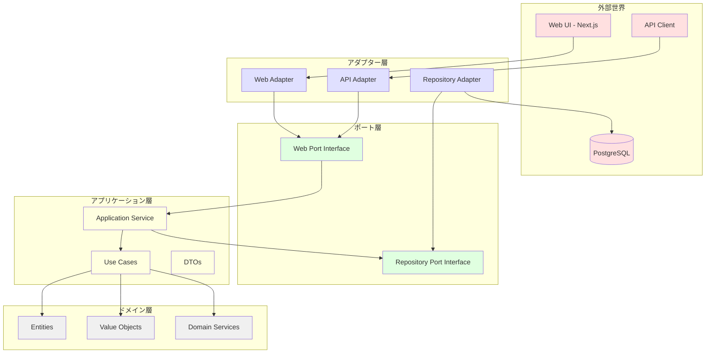

# TODOアプリケーション アプリケーションサービス アーキテクチャ設計

## 1. アーキテクチャ選択

**採用アーキテクチャ**: ポート&アダプターアーキテクチャ（適度な抽象化レベル）

### 選択理由
- **テスタビリティ重視**: 依存関係の逆転により、モックを使った単体テストが容易
- **保守性向上**: 明確な責務分離により、変更の影響範囲を限定
- **適度な抽象化**: リポジトリとWebインターフェースのみをポート化し、過度な複雑性を回避

## 2. アーキテクチャ概要図



## 3. ディレクトリ構造

```
src/
├── application/
│   ├── ports/
│   │   ├── input/
│   │   │   ├── TaskManagementPort.ts
│   │   │   └── TaskListManagementPort.ts
│   │   └── output/
│   │       ├── TaskRepositoryPort.ts
│   │       └── TaskListRepositoryPort.ts
│   ├── services/
│   │   ├── TaskApplicationService.ts
│   │   └── TaskListApplicationService.ts
│   ├── usecases/
│   │   ├── task/
│   │   │   ├── CreateTaskUseCase.ts
│   │   │   ├── UpdateTaskUseCase.ts
│   │   │   ├── DeleteTaskUseCase.ts
│   │   │   └── GetTasksUseCase.ts
│   │   └── taskList/
│   │       ├── CreateTaskListUseCase.ts
│   │       ├── UpdateTaskListUseCase.ts
│   │       ├── DeleteTaskListUseCase.ts
│   │       └── GetTaskListsUseCase.ts
│   └── dto/
│       ├── TaskDto.ts
│       ├── TaskListDto.ts
│       ├── CreateTaskDto.ts
│       ├── UpdateTaskDto.ts
│       ├── CreateTaskListDto.ts
│       └── UpdateTaskListDto.ts
├── infrastructure/
│   ├── adapters/
│   │   ├── input/
│   │   │   ├── web/
│   │   │   │   ├── TaskController.ts
│   │   │   │   └── TaskListController.ts
│   │   │   └── api/
│   │   │       ├── TaskApiAdapter.ts
│   │   │       └── TaskListApiAdapter.ts
│   │   └── output/
│   │       ├── persistence/
│   │       │   ├── PostgreSQLTaskRepository.ts
│   │       │   └── PostgreSQLTaskListRepository.ts
│   │       └── database/
│   │           ├── connection.ts
│   │           └── migrations/
│   └── config/
│       └── DependencyInjection.ts
└── domain/
    └── (既存のドメインモデル)
```

## 4. ポート定義

### 4.1 入力ポート（Input Ports）

#### TaskManagementPort
```typescript
export interface TaskManagementPort {
  createTask(dto: CreateTaskDto): Promise<TaskDto>;
  updateTask(id: string, dto: UpdateTaskDto): Promise<TaskDto>;
  deleteTask(id: string): Promise<void>;
  getTask(id: string): Promise<TaskDto | null>;
  getTasksByListId(listId: string): Promise<TaskDto[]>;
  getAllTasks(): Promise<TaskDto[]>;
}
```

#### TaskListManagementPort
```typescript
export interface TaskListManagementPort {
  createTaskList(dto: CreateTaskListDto): Promise<TaskListDto>;
  updateTaskList(id: string, dto: UpdateTaskListDto): Promise<TaskListDto>;
  deleteTaskList(id: string): Promise<void>;
  getTaskList(id: string): Promise<TaskListDto | null>;
  getAllTaskLists(): Promise<TaskListDto[]>;
}
```

### 4.2 出力ポート（Output Ports）

#### TaskRepositoryPort
```typescript
export interface TaskRepositoryPort {
  findById(taskId: TaskId): Promise<Task | null>;
  findByListId(listId: ListId): Promise<Task[]>;
  findAll(): Promise<Task[]>;
  save(task: Task): Promise<void>;
  delete(taskId: TaskId): Promise<void>;
}
```

#### TaskListRepositoryPort
```typescript
export interface TaskListRepositoryPort {
  findById(listId: ListId): Promise<TaskList | null>;
  findAll(): Promise<TaskList[]>;
  save(taskList: TaskList): Promise<void>;
  delete(listId: ListId): Promise<void>;
  findByName(name: ListName): Promise<TaskList | null>;
}
```

## 5. アプリケーションサービス実装

### TaskApplicationService
```typescript
export class TaskApplicationService implements TaskManagementPort {
  constructor(
    private taskRepository: TaskRepositoryPort,
    private taskListRepository: TaskListRepositoryPort
  ) {}

  async createTask(dto: CreateTaskDto): Promise<TaskDto> {
    // 1. DTOからドメインオブジェクトへの変換
    // 2. ビジネスルールの検証
    // 3. ドメインオブジェクトの永続化
    // 4. DTOへの変換と返却
  }

  async updateTask(id: string, dto: UpdateTaskDto): Promise<TaskDto> {
    // 1. 既存タスクの取得
    // 2. 更新処理
    // 3. 永続化
    // 4. DTOへの変換と返却
  }

  // その他のメソッド実装...
}
```

## 6. DTO設計

### TaskDto
```typescript
export interface TaskDto {
  id: string;
  title: string;
  description: string;
  dueDate: string | null; // ISO 8601形式
  status: 'TODO' | 'IN_PROGRESS' | 'DONE';
  listId: string;
  createdAt: string;
  updatedAt: string;
}
```

### CreateTaskDto
```typescript
export interface CreateTaskDto {
  title: string;
  description?: string;
  dueDate?: string; // ISO 8601形式
  status?: 'TODO' | 'IN_PROGRESS' | 'DONE';
  listId: string;
}
```

## 7. エラーハンドリング戦略

### アプリケーション層エラー
```typescript
export abstract class ApplicationError extends Error {
  abstract readonly code: string;
  abstract readonly statusCode: number;
}

export class TaskNotFoundError extends ApplicationError {
  readonly code = 'TASK_NOT_FOUND';
  readonly statusCode = 404;
  
  constructor(taskId: string) {
    super(`Task with id ${taskId} not found`);
  }
}

export class TaskListNotFoundError extends ApplicationError {
  readonly code = 'TASK_LIST_NOT_FOUND';
  readonly statusCode = 404;
  
  constructor(listId: string) {
    super(`Task list with id ${listId} not found`);
  }
}

export class ValidationError extends ApplicationError {
  readonly code = 'VALIDATION_ERROR';
  readonly statusCode = 400;
  
  constructor(message: string) {
    super(message);
  }
}
```

## 8. 依存性注入設計

### DependencyInjection.ts
```typescript
export class DependencyContainer {
  private static instance: DependencyContainer;
  private taskRepository: TaskRepositoryPort;
  private taskListRepository: TaskListRepositoryPort;
  private taskService: TaskManagementPort;
  private taskListService: TaskListManagementPort;

  private constructor() {
    // リポジトリの初期化
    this.taskRepository = new PostgreSQLTaskRepository();
    this.taskListRepository = new PostgreSQLTaskListRepository();
    
    // サービスの初期化
    this.taskService = new TaskApplicationService(
      this.taskRepository,
      this.taskListRepository
    );
    this.taskListService = new TaskListApplicationService(
      this.taskListRepository,
      this.taskRepository
    );
  }

  static getInstance(): DependencyContainer {
    if (!DependencyContainer.instance) {
      DependencyContainer.instance = new DependencyContainer();
    }
    return DependencyContainer.instance;
  }

  getTaskService(): TaskManagementPort {
    return this.taskService;
  }

  getTaskListService(): TaskListManagementPort {
    return this.taskListService;
  }
}
```

## 9. テスト戦略

### 単体テスト
```typescript
// TaskApplicationService.test.ts
describe('TaskApplicationService', () => {
  let taskService: TaskApplicationService;
  let mockTaskRepository: jest.Mocked<TaskRepositoryPort>;
  let mockTaskListRepository: jest.Mocked<TaskListRepositoryPort>;

  beforeEach(() => {
    mockTaskRepository = {
      findById: jest.fn(),
      findByListId: jest.fn(),
      findAll: jest.fn(),
      save: jest.fn(),
      delete: jest.fn(),
    };
    
    mockTaskListRepository = {
      findById: jest.fn(),
      findAll: jest.fn(),
      save: jest.fn(),
      delete: jest.fn(),
      findByName: jest.fn(),
    };

    taskService = new TaskApplicationService(
      mockTaskRepository,
      mockTaskListRepository
    );
  });

  describe('createTask', () => {
    it('should create a new task successfully', async () => {
      // テスト実装
    });
  });
});
```

## 10. Next.js統合

### API Routes実装
```typescript
// app/api/tasks/route.ts
import { DependencyContainer } from '@/infrastructure/config/DependencyInjection';

export async function GET() {
  try {
    const taskService = DependencyContainer.getInstance().getTaskService();
    const tasks = await taskService.getAllTasks();
    return Response.json(tasks);
  } catch (error) {
    // エラーハンドリング
  }
}

export async function POST(request: Request) {
  try {
    const dto = await request.json();
    const taskService = DependencyContainer.getInstance().getTaskService();
    const task = await taskService.createTask(dto);
    return Response.json(task, { status: 201 });
  } catch (error) {
    // エラーハンドリング
  }
}
```

## 11. 実装順序

1. **ポート定義** (1日目)
   - 入力ポート・出力ポートのインターフェース定義
   - DTO定義

2. **アプリケーションサービス実装** (2日目)
   - TaskApplicationService
   - TaskListApplicationService
   - エラーハンドリング

3. **リポジトリアダプター実装** (3日目)
   - PostgreSQLTaskRepository
   - PostgreSQLTaskListRepository
   - データベース接続

4. **Webアダプター実装** (4日目)
   - API Routes
   - エラーレスポンス統一

5. **依存性注入設定** (5日目)
   - DependencyContainer
   - 設定の統合

6. **テスト実装** (6日目)
   - 単体テスト
   - 統合テスト

## 12. 利点

### テスタビリティ
- ポートを使ったモック化により、外部依存なしでテスト可能
- 各層の責務が明確で、単体テストが書きやすい

### 保守性
- 依存関係の方向が明確（ドメイン層への一方向）
- 変更の影響範囲が限定される
- インターフェースによる契約が明確

### 拡張性
- 新しいアダプターの追加が容易
- ビジネスロジックを変更せずに技術的な実装を変更可能

この設計により、テスタビリティと保守性を重視しつつ、適度な抽象化レベルを保った実装が可能になります。