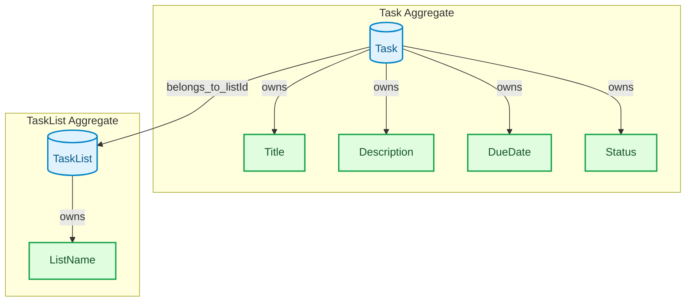

# TODOアプリケーション 戦術的設計

## 1. はじめに

このドキュメントは、TODOアプリケーションの戦術的設計について記述する。
戦略的設計 ([`strategicDesign.md`](strategicDesign.md)) で定義されたドメインとコンテキストに基づき、ドメインモデルを構成するエンティティ、値オブジェクト、集約、リポジトリなどを具体的に定義する。

## 2. エンティティ (Entities)

システムの中核となるビジネスオブジェクト。一意な識別子を持ち、ライフサイクルを通じて状態が変化する。

### 2.1. `Task` (タスク)

*   **責務:** 実行すべき作業や事柄を表す。
*   **識別子:** `taskId` (UUIDなど、一意なID)
*   **属性:**
    *   `title` (タイトル): タスクの名称 (値オブジェクトとして後ほど定義)
    *   `description` (説明): タスクの詳細な内容 (値オブジェクトとして後ほど定義)
    *   `dueDate` (期日): タスクの完了目標日 (値オブジェクトとして後ほど定義)
    *   `status` (ステータス): タスクの進捗状況 (値オブジェクトとして後ほど定義)
    *   `listId` (リストID): 所属するリストのID (必須)

### 2.2. `TaskList` (タスクリスト)

*   **責務:** 複数のタスクを分類・管理するためのグループを表す。
*   **識別子:** `listId` (UUIDなど、一意なID)
*   **属性:**
    *   `name` (リスト名): リストの名称 (値オブジェクトとして後ほど定義)

## 3. 値オブジェクト (Value Objects)

属性の集まりであり、それ自体がドメインの関心事を表す。不変であり、識別子を持たない。

### 3.1. `Title` (タイトル)

*   **責務:** タスクやリストの名称を表す。
*   **特性:**
    *   不変 (immutable)。
    *   空であってはならない。
    *   一定の文字数制限を設ける（例: 255文字以内）。

### 3.2. `Description` (説明)

*   **責務:** タスクの詳細な内容を表す。
*   **特性:**
    *   不変 (immutable)。
    *   空でもよい。
    *   一定の文字数制限を設ける（例: 1000文字以内）。

### 3.3. `DueDate` (期日)

*   **責務:** タスクの完了目標日を表す。
*   **特性:**
    *   不変 (immutable)。
    *   日付形式（例: YYYY-MM-DD）。
    *   過去の日付は設定できない（あるいは警告する）。

### 3.4. `Status` (ステータス)

*   **責務:** タスクの進捗状況を表す。
*   **特性:**
    *   不変 (immutable)。
    *   定義済みの状態のみ許可（例: `未着手`, `進行中`, `完了`）。Enum型として表現可能。

### 3.5. `ListName` (リスト名)

*   **責務:** タスクリストの名称を表す。
*   **特性:**
    *   不変 (immutable)。
    *   空であってはならない。
    *   一定の文字数制限を設ける（例: 100文字以内）。

## 4. 集約 (Aggregates)

一貫性の境界となる、エンティティと値オブジェクトのまとまり。集約ルートを通じてのみ外部からアクセスされる。

### 4.1. `Task` 集約

*   **ルートエンティティ:** `Task`
*   **含まれる要素:**
    *   `Task` エンティティ
    *   `Title` (値オブジェクト)
    *   `Description` (値オブジェクト)
    *   `DueDate` (値オブジェクト)
    *   `Status` (値オブジェクト)
*   **責務:** 個々のタスクに関する情報（タイトル、説明、期日、ステータス、所属リストID）の一貫性を保証する。タスクの作成、更新、削除は、この集約を通じて行われる。
*   **不変条件の例:**
    *   `Task` は必ず `listId` を持つ。
    *   `Status` は定義された値のいずれかでなければならない。

### 4.2. `TaskList` 集約

*   **ルートエンティティ:** `TaskList`
*   **含まれる要素:**
    *   `TaskList` エンティティ
    *   `ListName` (値オブジェクト)
*   **責務:** タスクリスト自体の情報（名前など）の一貫性を保証する。リストの作成、名前の変更、リストの削除などはこの集約を通じて行われる。
*   **不変条件の例:**
    *   `ListName` は空であってはならない。
*   **備考:**
    *   現時点では、リスト内のタスクの順序を管理するための `taskIds` (タスクIDのリスト) は保持しない。タスクの所属は `Task.listId` で表現される。
    *   将来的にリスト内でのタスクの厳密な順序管理（ユーザーによる並び替えなど）が必要になった場合、この集約に `taskIds: List<TaskId>` を追加することを検討する。その際のメリット・デメリットは別途議論済み。

## 5. リポジトリ (Repositories)

集約の永続化と再構築を担当する。コレクションのようなインターフェースを提供する。

### 5.1. `TaskRepository` インターフェース

*   `findById(taskId: TaskId): Promise<Task | null>`
    *   指定されたIDのタスクを取得します。見つからない場合は `null` を返します。
*   `findByListId(listId: ListId): Promise<Task[]>`
    *   指定されたリストIDに所属するすべてのタスクを取得します。
*   `save(task: Task): Promise<void>`
    *   タスクを永続化します（新規作成または更新）。
*   `delete(taskId: TaskId): Promise<void>`
    *   指定されたIDのタスクを削除します。
*   *(オプション)* `findAll(): Promise<Task[]>`
    *   すべてのタスクを取得します。（主にデバッグや管理用。通常は `findByListId` などで絞り込みます）

### 5.2. `TaskListRepository` インターフェース

*   `findById(listId: ListId): Promise<TaskList | null>`
    *   指定されたIDのタスクリストを取得します。見つからない場合は `null` を返します。
*   `findAll(): Promise<TaskList[]>`
    *   すべてのタスクリストを取得します。
*   `save(taskList: TaskList): Promise<void>`
    *   タスクリストを永続化します（新規作成または更新）。
*   `delete(listId: ListId): Promise<void>`
    *   指定されたIDのタスクリストを削除します。**この操作を実行すると、削除されるタスクリストに所属するすべてのタスクも同時に削除されます。**
*   *(オプション)* `findByName(name: ListName): Promise<TaskList | null>`
    *   指定された名前のタスクリストを取得します。（リスト名が一意である場合に有効）

## 6. ドメインサービス (Domain Services)

特定のエンティティや値オブジェクトに属さないドメインロジックをカプセル化する。

現時点の設計では、主要なドメインロジックは各集約（`Task`集約、`TaskList`集約）の内部メソッドや、リポジトリを通じた操作で表現可能である。
複数の集約にまたがる複雑なドメイン固有の操作や、いずれのエンティティにも自然に属さないビジネスルールは明確には特定されていない。

したがって、**現時点では明示的なドメインサービスは導入しない。**

将来的に、以下のようなケースが発生した場合には、ドメインサービスの導入を検討する。
*   複数の集約を操作し、ドメインとしての一貫性を保つ必要がある複雑なビジネスプロセス。
*   特定のエンティティの状態に依存しない、ドメイン全体に関わる計算や検証ロジック。

複合的な操作（例: 新しいリストを作成し、同時にそのリストに複数の初期タスクを追加する）は、アプリケーションサービス層で複数のリポジトリ操作や集約メソッド呼び出しを調整することで実現する。

## 7. ドメインモデル図 (Mermaid)

エンティティ、値オブジェクト、集約の関係性を視覚的に表現する。

