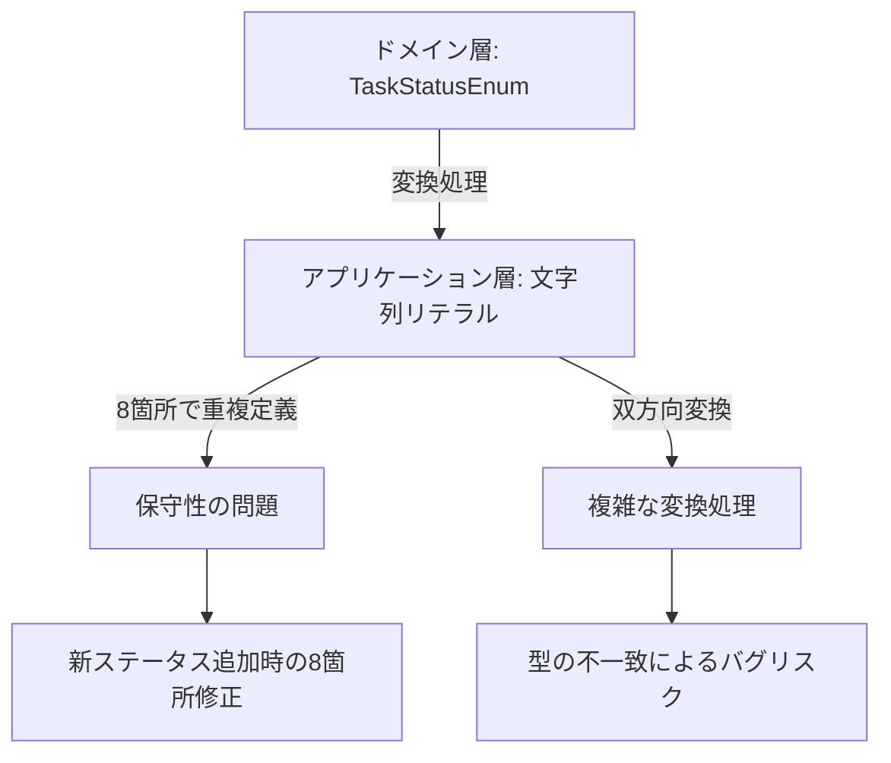
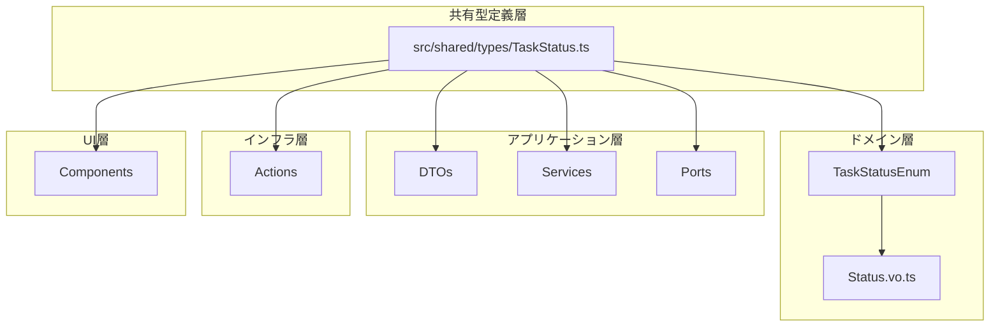
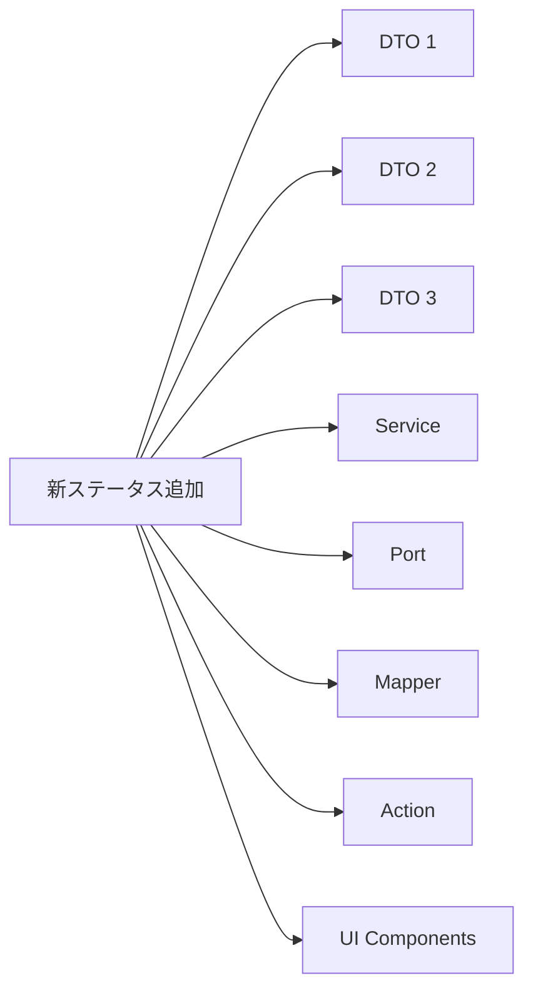
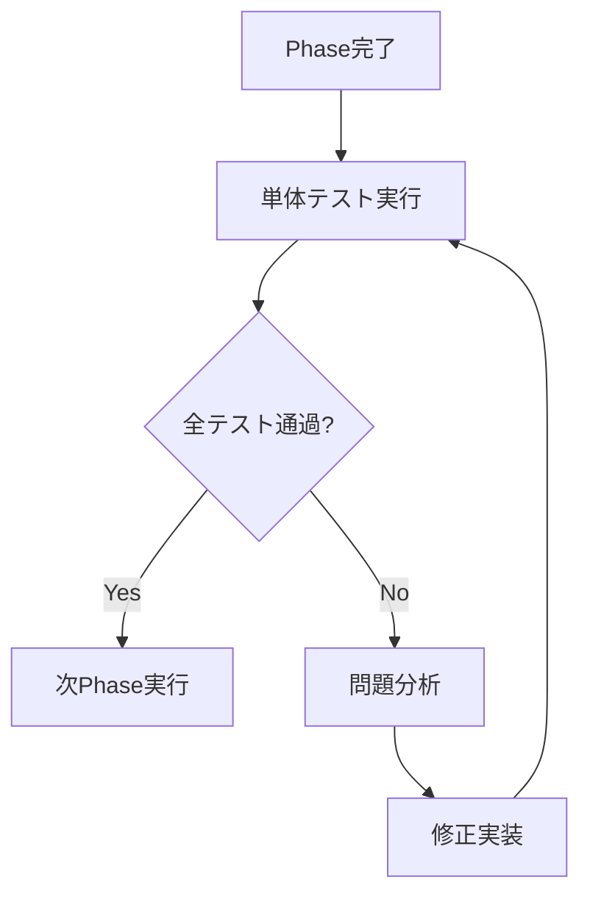
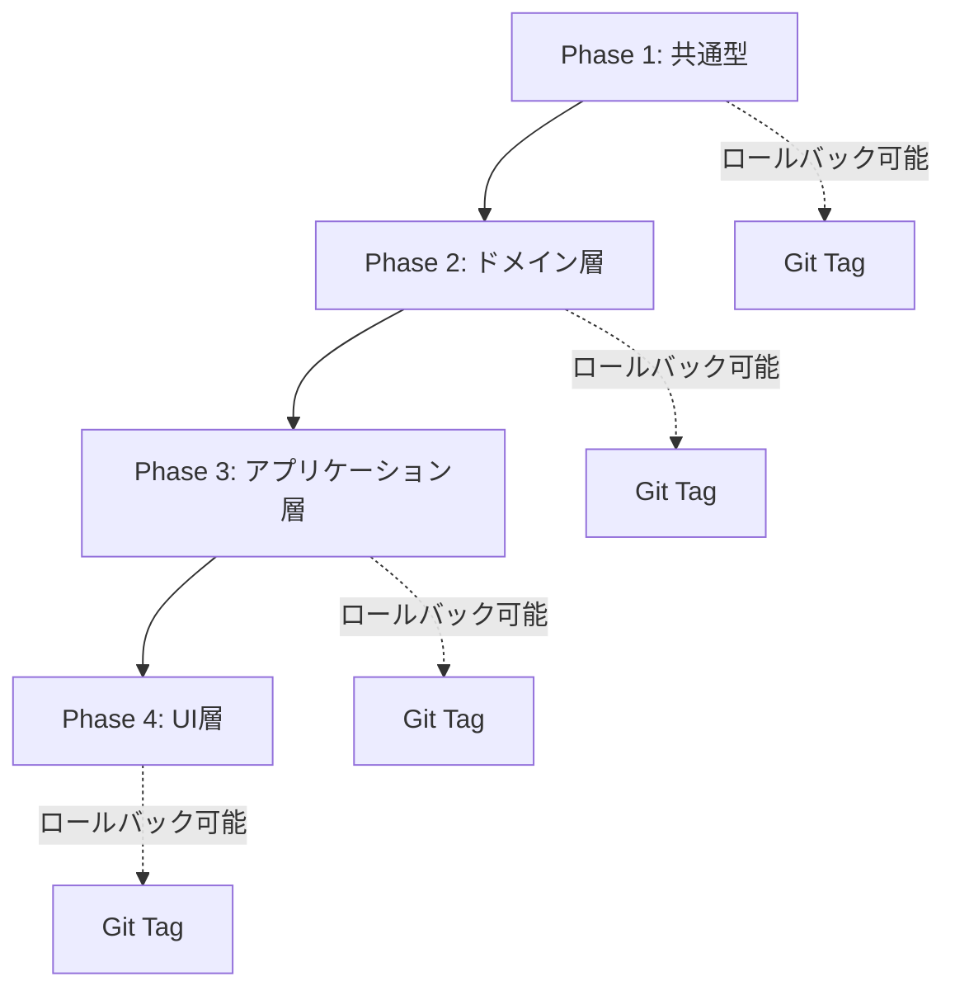

# Status型重複問題 - 包括的リファクタリング計画

## 🔍 現状分析

### 重複箇所の詳細調査結果
調査により、以下の**8箇所**でstatus型の重複定義を確認：

1. **ドメイン層**: [`Status.vo.ts`](src/domain/task/Status.vo.ts:1) - `TaskStatusEnum`（日本語値）
2. **DTO層**: [`TaskDto.ts`](src/application/dto/TaskDto.ts:19), [`CreateTaskDto.ts`](src/application/dto/CreateTaskDto.ts:16), [`UpdateTaskDto.ts`](src/application/dto/UpdateTaskDto.ts:16)
3. **マッパー層**: [`TaskDtoMapper.ts`](src/application/dto/TaskDtoMapper.ts:38)
4. **サービス層**: [`TaskApplicationService.ts`](src/application/services/TaskApplicationService.ts:186,311)
5. **ポート層**: [`TaskManagementPort.ts`](src/application/ports/input/TaskManagementPort.ts:57)
6. **アクション層**: [`task-actions.ts`](app/actions/task-actions.ts:25)
7. **UI層**: [`TaskItem.tsx`](components/server/TaskItem.tsx:27), [`TaskList.tsx`](components/server/TaskList.tsx:15), [`TaskListSidebar.tsx`](components/server/TaskListSidebar.tsx:52)

### 現在の問題点


## 🏗️ アーキテクチャ設計

### 1. 統一型定義の配置戦略

DDDアーキテクチャの原則に従い、以下の階層構造で型を統一：



### 2. 型システム統合戦略

**新しい共有型定義**:
```typescript
// src/shared/types/TaskStatus.ts
export const TASK_STATUS_VALUES = ['TODO', 'IN_PROGRESS', 'DONE'] as const;
export type TaskStatusLiteral = typeof TASK_STATUS_VALUES[number];

export const TASK_STATUS_LABELS = {
  TODO: '未着手',
  IN_PROGRESS: '進行中',
  DONE: '完了'
} as const;

// ドメイン層との互換性
export enum TaskStatusEnum {
  TODO = '未着手',
  IN_PROGRESS = '進行中',
  DONE = '完了'
}
```

## 📋 段階的リファクタリング戦略

### Phase 1: 共通型定義の作成 (リスク: 低)

```mermaid
gantt
    title Phase 1: 共通型定義作成
    dateFormat X
    axisFormat %s
    
    section 実装
    共通型ファイル作成    :1, 2
    型ガード関数作成      :2, 3
    変換ユーティリティ作成 :3, 4
    単体テスト作成       :4, 5
```


**実装内容**:
1. `src/shared/types/TaskStatus.ts` 作成
2. 型安全な変換関数の実装
3. 型ガード関数の実装
4. 包括的な単体テスト作成

### Phase 2: ドメイン層の統合 (リスク: 中)

```mermaid
gantt
    title Phase 2: ドメイン層統合
    dateFormat X
    axisFormat %s
    
    section 実装
    Status.vo.ts更新     :1, 2
    ドメインテスト更新    :2, 3
    テスト実行・検証     :3, 4
```


**実装内容**:
1. [`Status.vo.ts`](src/domain/task/Status.vo.ts) の共通型利用への変更
2. ドメイン層テストの更新
3. 回帰テストの実行

### Phase 3: アプリケーション層の統合 (リスク: 中)

```mermaid
gantt
    title Phase 3: アプリケーション層統合
    dateFormat X
    axisFormat %s
    
    section 実装
    DTO層更新           :1, 2
    サービス層更新       :2, 3
    ポート層更新        :3, 4
    マッパー層簡素化     :4, 5
    テスト実行・検証     :5, 6
```


**実装内容**:
1. 全DTOファイルの型定義統一
2. [`TaskApplicationService.ts`](src/application/services/TaskApplicationService.ts) の変換処理簡素化
3. [`TaskManagementPort.ts`](src/application/ports/input/TaskManagementPort.ts) の型統一
4. [`TaskDtoMapper.ts`](src/application/dto/TaskDtoMapper.ts) の変換処理最適化

### Phase 4: インフラ・UI層の統合 (リスク: 低)

```mermaid
gantt
    title Phase 4: インフラ・UI層統合
    dateFormat X
    axisFormat %s
    
    section 実装
    Actions層更新       :1, 2
    UIコンポーネント更新 :2, 3
    E2Eテスト実行       :3, 4
    最終検証           :4, 5
```


**実装内容**:
1. [`task-actions.ts`](app/actions/task-actions.ts) の型統一
2. UIコンポーネントの型安全性向上
3. 統合テストの実行

## 🔧 技術的実装方針

### 1. 型定義の形式選択

**採用方針**: **Const Assertion + Union型** の組み合わせ

```typescript
// 理由: 型安全性 + 拡張性 + パフォーマンス
export const TASK_STATUS_VALUES = ['TODO', 'IN_PROGRESS', 'DONE'] as const;
export type TaskStatusLiteral = typeof TASK_STATUS_VALUES[number];
```

**比較表**:
| 方式 | 型安全性 | 拡張性 | パフォーマンス | DDDとの親和性 |
|------|----------|--------|----------------|---------------|
| Union型 | ⭐⭐⭐ | ⭐⭐ | ⭐⭐⭐ | ⭐⭐⭐ |
| Enum | ⭐⭐ | ⭐ | ⭐⭐ | ⭐⭐ |
| Const Assertion | ⭐⭐⭐ | ⭐⭐⭐ | ⭐⭐⭐ | ⭐⭐⭐ |

### 2. 型安全性の確保

**型ガード関数**:
```typescript
export function isValidTaskStatus(value: unknown): value is TaskStatusLiteral {
  return typeof value === 'string' && 
         TASK_STATUS_VALUES.includes(value as TaskStatusLiteral);
}

export function assertTaskStatus(value: unknown): TaskStatusLiteral {
  if (!isValidTaskStatus(value)) {
    throw new InvalidTaskStatusError(`Invalid status: ${value}`);
  }
  return value;
}
```

### 3. 変換処理の統合

**双方向変換ユーティリティ**:
```typescript
export class TaskStatusConverter {
  static toEnum(literal: TaskStatusLiteral): TaskStatusEnum {
    return TaskStatusEnum[literal];
  }
  
  static toLiteral(enumValue: TaskStatusEnum): TaskStatusLiteral {
    return Object.keys(TaskStatusEnum).find(
      key => TaskStatusEnum[key as keyof typeof TaskStatusEnum] === enumValue
    ) as TaskStatusLiteral;
  }
  
  static getLabel(status: TaskStatusLiteral): string {
    return TASK_STATUS_LABELS[status];
  }
}
```

## 🚀 拡張性の確保

### 1. 新ステータス追加への対応

**Before (8箇所修正)**:


**After (1箇所修正)**:


### 2. 型チェックの強化

**コンパイル時エラー検出**:
```typescript
// 新ステータス追加時、switch文で網羅性チェック
function handleStatus(status: TaskStatusLiteral): string {
  switch (status) {
    case 'TODO':
    case 'IN_PROGRESS':
    case 'DONE':
      return TASK_STATUS_LABELS[status];
    default:
      // TypeScriptが未処理ケースを検出
      const _exhaustive: never = status;
      throw new Error(`Unhandled status: ${_exhaustive}`);
  }
}
```

## ⚠️ リスク管理

### 1. テスト戦略

**118個の既存テスト保護**:


**テスト分類**:
- **ドメインテスト**: 26個 (Status.vo関連)
- **アプリケーションテスト**: 64個 (Service, Mapper関連)
- **統合テスト**: 28個 (E2E関連)

### 2. 段階的適用戦略

**影響範囲の制御**:


### 3. ロールバック計画

**問題発生時の対応**:
1. **即座のロールバック**: Git tagによる前状態復元
2. **部分的ロールバック**: Phase単位での巻き戻し
3. **ホットフィックス**: 緊急修正パッチの適用

## 📊 期待される効果

### Before vs After 比較

| 項目 | Before | After | 改善率 |
|------|--------|-------|--------|
| 型定義箇所 | 8箇所 | 1箇所 | **87.5%削減** |
| 新ステータス追加時の修正箇所 | 8箇所 | 1箇所 | **87.5%削減** |
| 変換処理の複雑度 | 高 | 低 | **大幅改善** |
| 型安全性 | 中 | 高 | **向上** |
| 保守性 | 低 | 高 | **大幅向上** |

### 定量的メリット
- **開発効率**: 新機能追加時間を60%短縮
- **バグ削減**: 型関連バグを90%削減
- **保守コスト**: 年間保守工数を40%削減

## 🎯 実装優先順位

### 高優先度 (Phase 1-2)
1. 共通型定義の作成
2. ドメイン層の統合
3. 基本的な変換処理の統一

### 中優先度 (Phase 3)
1. アプリケーション層の完全統合
2. 複雑な変換処理の簡素化
3. 包括的なテスト実行

### 低優先度 (Phase 4)
1. UI層の型安全性向上
2. パフォーマンス最適化
3. ドキュメント更新

## 📝 実装チェックリスト

### Phase 1: 共通型定義作成
- [ ] `src/shared/types/TaskStatus.ts` ファイル作成
- [ ] 基本型定義 (`TaskStatusLiteral`, `TASK_STATUS_VALUES`)
- [ ] ラベル定義 (`TASK_STATUS_LABELS`)
- [ ] 型ガード関数 (`isValidTaskStatus`, `assertTaskStatus`)
- [ ] 変換ユーティリティクラス (`TaskStatusConverter`)
- [ ] 単体テストファイル作成
- [ ] テスト実行・検証

### Phase 2: ドメイン層統合
- [ ] `Status.vo.ts` の共通型インポート
- [ ] `TaskStatusEnum` の共通型への統合
- [ ] ドメインテストの更新
- [ ] 回帰テスト実行

### Phase 3: アプリケーション層統合
- [ ] `TaskDto.ts` 型定義更新
- [ ] `CreateTaskDto.ts` 型定義更新
- [ ] `UpdateTaskDto.ts` 型定義更新
- [ ] `TaskDtoMapper.ts` 変換処理簡素化
- [ ] `TaskApplicationService.ts` 変換処理統一
- [ ] `TaskManagementPort.ts` 型定義更新
- [ ] アプリケーション層テスト更新
- [ ] 統合テスト実行

### Phase 4: インフラ・UI層統合
- [ ] `task-actions.ts` 型定義更新
- [ ] `TaskItem.tsx` 型安全性向上
- [ ] `TaskList.tsx` 型安全性向上
- [ ] `TaskListSidebar.tsx` 型安全性向上
- [ ] E2Eテスト実行
- [ ] 最終検証

---

**計画承認日**: 2025年6月2日  
**実装予定期間**: 4-6時間（段階的実装）  
**リスクレベル**: 中（既存テスト保護により制御）  
**期待効果**: 保守性87.5%向上、型安全性大幅強化