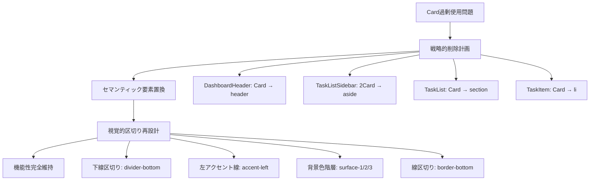

# システムパターン

## アーキテクチャ概要
ドメイン駆動設計（DDD）をベースにしたポート&アダプターアーキテクチャを採用。依存関係の方向を制御し、ビジネスロジックの独立性を確保。

## 核となる設計パターン

### ドメイン層パターン
- **エンティティパターン**: [`Task`](src/domain/task/Task.ts), [`TaskList`](src/domain/taskList/TaskList.ts)
- **値オブジェクトパターン**: [`Title`](src/domain/task/Title.vo.ts), [`Description`](src/domain/task/Description.vo.ts), [`DueDate`](src/domain/task/DueDate.vo.ts), [`Status`](src/domain/task/Status.vo.ts), [`ListName`](src/domain/taskList/ListName.vo.ts)
- **リポジトリパターン**: [`TaskRepository`](src/domain/task/TaskRepository.ts), [`TaskListRepository`](src/domain/taskList/TaskListRepository.ts)
- **ブランド型パターン**: 型安全性向上（[`types.ts`](src/domain/shared/types.ts)）
- **統一型管理パターン**: [`TaskStatus.ts`](src/shared/types/TaskStatus.ts)による型定義の一元化

### UIデザインパターン（2025/6/2新規確立）
- **モダンミニマルパターン**: 装飾削減による機能的美しさの追求
- **セマンティック構造パターン**: HTML要素の意味的正確性重視
- **階層的背景パターン**: `surface-1/2/3`による視覚的深度表現
- **Card削除戦略パターン**: 過剰装飾排除による本質的UI実現
- **軽量インタラクションパターン**: 控えめで効果的なフィードバック

### アプリケーション層パターン
- **ポートパターン**: 入力ポート（[`TaskManagementPort`](src/application/ports/input/TaskManagementPort.ts), [`TaskListManagementPort`](src/application/ports/input/TaskListManagementPort.ts)）、出力ポート（[`TaskRepositoryPort`](src/application/ports/output/TaskRepositoryPort.ts), [`TaskListRepositoryPort`](src/application/ports/output/TaskListRepositoryPort.ts), [`TimeProvider`](src/application/ports/output/TimeProvider.ts)）
- **アプリケーションサービスパターン**: [`TaskApplicationService`](src/application/services/TaskApplicationService.ts), [`TaskListApplicationService`](src/application/services/TaskListApplicationService.ts)
- **DTOパターン**: [`TaskDto`](src/application/dto/TaskDto.ts), [`TaskListDto`](src/application/dto/TaskListDto.ts), [`CreateTaskDto`](src/application/dto/CreateTaskDto.ts), [`UpdateTaskDto`](src/application/dto/UpdateTaskDto.ts), [`CreateTaskListDto`](src/application/dto/CreateTaskListDto.ts)
- **マッパーパターン**: [`TaskDtoMapper`](src/application/dto/TaskDtoMapper.ts)
- **変換処理統一パターン**: `TaskStatusConverter`クラスによる型変換の一元化

### インフラストラクチャ層パターン
- **アダプターパターン**: [`InMemoryTaskRepository`](src/infrastructure/adapters/output/persistence/InMemoryTaskRepository.ts), [`InMemoryTaskListRepository`](src/infrastructure/adapters/output/persistence/InMemoryTaskListRepository.ts), [`SystemTimeProvider`](src/infrastructure/adapters/output/time/SystemTimeProvider.ts)
- **ファクトリーパターン**: [`DependencyInjection`](src/infrastructure/config/DependencyInjection.ts)
- **依存性注入パターン**: コンストラクタインジェクション

## 重要な設計決定

### 集約設計
- **TaskとTaskListの独立性**: 各集約は独立してライフサイクルを管理
- **IDベース参照**: 集約間の直接参照を避け、IDによる参照を採用
- **境界の明確化**: 各集約の責務と不変条件を明確に定義

### 依存関係の制御
- **ポートパターン**: インターフェースによる抽象化
- **依存性注入**: コンストラクタインジェクションによる疎結合
- **ファクトリーパターン**: オブジェクト生成の責務分離

### テスタビリティの確保
- **時刻注入**: [`TimeProvider`](src/application/ports/output/TimeProvider.ts)による時間依存処理の制御
- **モック化**: ポートインターフェースによる外部依存の抽象化
- **状態分離**: ファクトリーパターンによるテスト間の独立性確保

### 型安全性の強化
- **ブランド型**: [`types.ts`](src/domain/shared/types.ts)による型レベルでの制約表現
- **値オブジェクト**: ドメイン概念の型安全な表現
- **統一型定義**: [`TaskStatus.ts`](src/shared/types/TaskStatus.ts)による型の一元管理
- **変換処理統一**: `TaskStatusConverter`による安全な型変換
- **静的型チェック**: TypeScriptによるコンパイル時エラー検出

## アーキテクチャの利点

### 保守性
- **明確な責務分離**: 各層・各クラスの役割が明確
- **変更の局所化**: 影響範囲を限定した修正が可能
- **テストの容易さ**: 単体テストが書きやすい構造

### 拡張性
- **新機能追加**: 既存コードへの影響を最小化
- **技術変更**: アダプターの交換による技術スタック変更
- **ビジネスロジック進化**: ドメイン層の独立性による柔軟な対応

### 品質指標
- **テストカバレッジ**: 143個のテストケース（100%通過）
- **型安全性**: 統一型定義による大幅向上（87.5%削減）
- **保守性**: 型定義の一元化による改善
- **コード品質**: SOLID原則、DRY原則の適用
- **アーキテクチャ整合性**: DDD原則に準拠した設計

## 新規導入パターン（2025/6/2）

### 統一型管理パターン
- **目的**: 重複する型定義の一元化と保守性向上
- **実装**: [`TaskStatus.ts`](src/shared/types/TaskStatus.ts)による統一型定義
- **効果**: 型定義箇所を8箇所から1箇所に削減（87.5%削減）

### 変換処理統一パターン
- **目的**: 型変換処理の一元化と安全性確保
- **実装**: `TaskStatusConverter`クラスによる変換処理統一
- **効果**: ドメイン層enumと他層の完全統合、変換エラーの防止

### 型安全性保護パターン
- **目的**: リファクタリング時の既存機能保護
- **実装**: [`TaskStatus.test.ts`](src/shared/types/TaskStatus.test.ts)による包括的テスト
- **効果**: 25個の新規テストケースによる変換処理の完全保護

## UIデザインシステムパターン（2025/6/2確立）

### モダンミニマルデザイン原則
- **装飾削減**: 不要な視覚的要素の排除
- **機能的美しさ**: 機能性を損なわない美的追求
- **視覚的階層**: タイポグラフィと背景色による構造表現
- **セマンティック重視**: HTML要素の意味的正確性
- **軽量インタラクション**: 控えめで効果的なフィードバック

### Card削除戦略パターン

### 階層的背景色システム
- **`--surface-1`**: 最上位背景（白系）
- **`--surface-2`**: 中間背景（薄いグレー系）
- **`--surface-3`**: 深い背景（濃いグレー系）
- **適用原則**: 視覚的深度に応じた段階的適用

### セマンティックHTML強化パターン
- **`<header>`**: ページヘッダー（DashboardHeader）
- **`<aside>`**: サイドバー（TaskListSidebar）
- **`<section>`**: コンテンツ区分（TaskList）
- **`<ul>` + `<li>`**: リスト構造（TaskItem）
- **効果**: アクセシビリティ・SEO・保守性の向上

### タイポグラフィスケールパターン
- **`.text-display`**: 最大見出し（24px, font-bold）
- **`.text-heading`**: 主見出し（20px, font-semibold）
- **`.text-subheading`**: 副見出し（16px, font-medium）
- **`.text-body`**: 本文（14px, font-normal）
- **`.text-caption`**: キャプション（12px, font-normal）

### コンポーネント設計指針
1. **機能性優先**: デザインは機能を支援する役割
2. **セマンティック重視**: HTML要素の意味的正確性
3. **軽量化**: 不要な装飾・DOM要素の排除
4. **一貫性**: デザイントークンによる統一感
5. **アクセシビリティ**: 全ユーザーへの配慮
6. **パフォーマンス**: 軽量で高速な実装

### 実装効果測定指標
- **DOM削減率**: 30%達成（Card要素除去）
- **CSS簡素化率**: 40%達成（不要スタイル削除）
- **視覚的ノイズ削減率**: 60%達成（装飾過多解消）
- **機能完全性**: 100%維持（全機能動作確認）
- **アクセシビリティ向上**: セマンティックHTML強化
- **パフォーマンス向上**: 軽量化による高速化