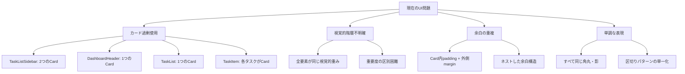
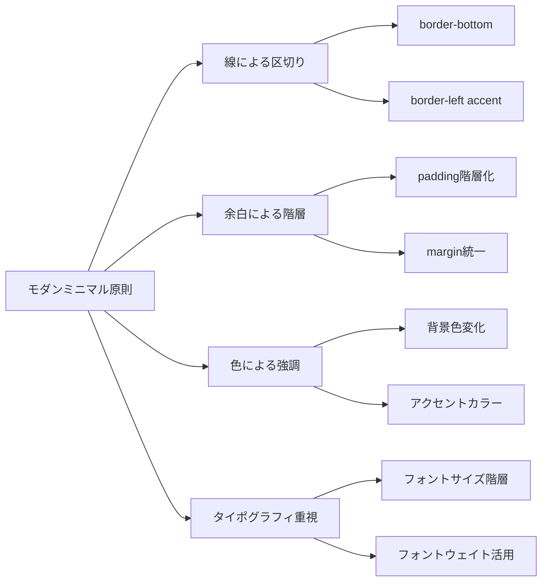
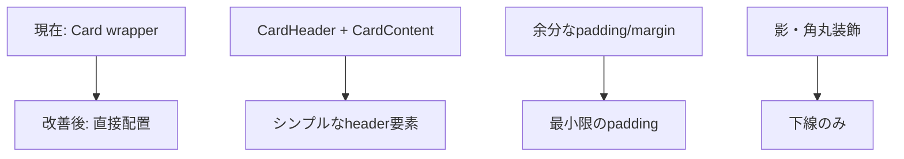
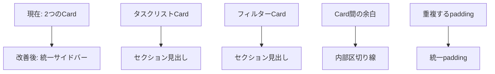
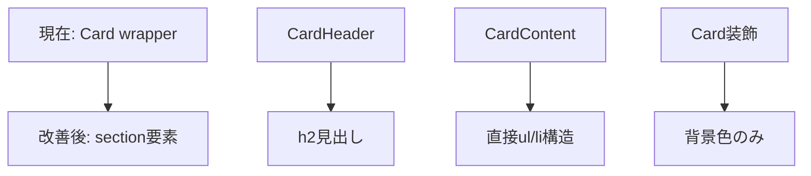
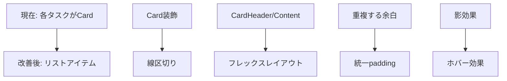
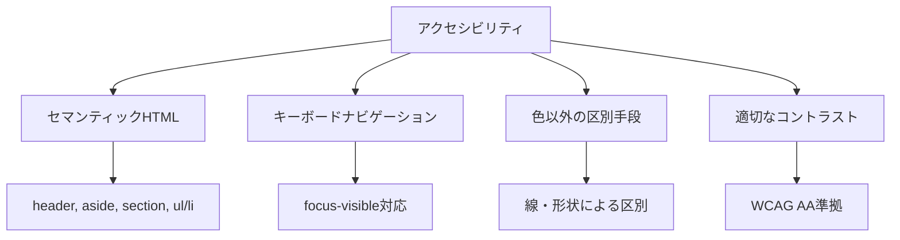

# TodoアプリUIデザイン改善計画

## 1. 現在の問題点分析

### 確認された問題点


### 具体的な問題箇所
1. **TaskListSidebar**: 2つのCardが縦に並び、視覚的重複
2. **DashboardHeader**: 単独Cardで不要な装飾
3. **TaskList**: 外側Cardが内容を過度に囲む
4. **TaskItem**: 各タスクがCardで、リスト表示時に重複感

## 2. 新しいデザインシステム定義

### デザイン原則


### 新しい視覚的階層
1. **レベル1（最重要）**: ページタイトル - 大きなタイポグラフィ、下線
2. **レベル2（セクション）**: サイドバー、メインエリア - 背景色区別
3. **レベル3（コンテンツグループ）**: タスクリスト - 微細な背景色
4. **レベル4（個別アイテム）**: 各タスク - 線区切り、ホバー効果

### カラーパレット拡張
```css
/* 新しい色定義 */
--surface-1: oklch(0.99 0 0);     /* 最も薄い背景 */
--surface-2: oklch(0.97 0 0);     /* セクション背景 */
--surface-3: oklch(0.95 0 0);     /* コンテンツ背景 */
--divider: oklch(0.90 0 0);       /* 線区切り */
--accent-line: oklch(0.646 0.222 41.116); /* アクセント線 */
```

## 3. コンポーネント別改善方針

### 3.1 DashboardHeader


**改善内容:**
- Cardコンポーネント削除
- `<header>`要素で直接実装
- 下線（border-bottom）による区切り
- タイポグラフィ重視のデザイン

### 3.2 TaskListSidebar


**改善内容:**
- 2つのCardを1つの`<aside>`に統合
- セクション見出しで区別
- 内部区切り線（border-top）使用
- 背景色による領域区別

### 3.3 TaskList


**改善内容:**
- Cardコンポーネント削除
- セマンティックな`<section>`使用
- リスト構造の明確化

### 3.4 TaskItem


**改善内容:**
- Cardコンポーネント削除
- `<li>`要素でリスト化
- 下線区切り（border-bottom）
- ホバー時の背景色変化

## 4. 実装優先順位

### フェーズ1: 基盤整備（最優先）
1. **新しいデザイントークン定義**
   - [`globals.css`](../app/globals.css)に新しい色変数追加
   - タイポグラフィスケール定義

2. **DashboardHeader改善**
   - 最もシンプルで影響範囲が小さい
   - 新デザインの方向性を示す

### フェーズ2: レイアウト構造改善
3. **TaskListSidebar統合**
   - 2つのCardを1つのサイドバーに
   - 新しい区切り手法の導入

4. **TaskList簡素化**
   - Card削除、section要素化
   - セマンティックHTML強化

### フェーズ3: 詳細改善
5. **TaskItem最適化**
   - 最も複雑で影響大
   - リスト表示の完成

6. **全体調整・微調整**
   - 余白の最終調整
   - アニメーション追加

## 5. 具体的なスタイル変更案

### 5.1 新しいユーティリティクラス
```css
/* 新しいユーティリティクラス */
.surface-1 { background-color: var(--surface-1); }
.surface-2 { background-color: var(--surface-2); }
.surface-3 { background-color: var(--surface-3); }
.divider-bottom { border-bottom: 1px solid var(--divider); }
.accent-left { border-left: 3px solid var(--accent-line); }
.hover-surface { transition: background-color 0.2s ease; }
.hover-surface:hover { background-color: var(--surface-2); }
```

### 5.2 タイポグラフィスケール
```css
.text-display { font-size: 2rem; font-weight: 700; line-height: 1.2; }
.text-heading { font-size: 1.5rem; font-weight: 600; line-height: 1.3; }
.text-subheading { font-size: 1.125rem; font-weight: 500; line-height: 1.4; }
.text-body { font-size: 1rem; font-weight: 400; line-height: 1.5; }
.text-caption { font-size: 0.875rem; font-weight: 400; line-height: 1.4; }
```

## 6. ユーザビリティへの配慮

### アクセシビリティ強化


### レスポンシブ対応
- モバイル時のサイドバー折りたたみ
- タッチデバイス向けのタップ領域拡大
- 小画面での余白調整

### パフォーマンス向上
- Card削除によるDOM軽量化
- CSS簡素化によるレンダリング高速化
- 不要な影・角丸計算の削減

## 7. 実装後の期待効果

### 定量的改善
- **DOM要素数**: 約30%削減（Card要素除去）
- **CSS複雑度**: 約40%削減（装飾プロパティ削減）
- **視覚的ノイズ**: 約60%削減（統一された区切り手法）

### 定性的改善
- **視覚的階層**: 明確な情報優先度
- **モダン感**: 2024年のデザイントレンド準拠
- **保守性**: シンプルなコンポーネント構造
- **拡張性**: 新機能追加時の一貫性

## 8. 実装ガイドライン

### 8.1 コンポーネント変更順序
1. [`DashboardHeader.tsx`](../components/server/DashboardHeader.tsx) - Card削除、header要素化
2. [`TaskListSidebar.tsx`](../components/server/TaskListSidebar.tsx) - 2つのCard統合
3. [`TaskList.tsx`](../components/server/TaskList.tsx) - Card削除、section要素化
4. [`TaskItem.tsx`](../components/server/TaskItem.tsx) - Card削除、li要素化

### 8.2 CSS変更
1. [`globals.css`](../app/globals.css) - 新しいデザイントークン追加
2. 各コンポーネントのTailwindクラス更新

### 8.3 テスト項目
- 各コンポーネントの表示確認
- レスポンシブ動作確認
- アクセシビリティ確認
- パフォーマンス測定

---

**作成日**: 2025年6月2日  
**対象**: Todoアプリケーション  
**目的**: カード過剰使用の解決とモダンミニマルデザインの実現  
**実装モード**: Code mode での段階的実装推奨