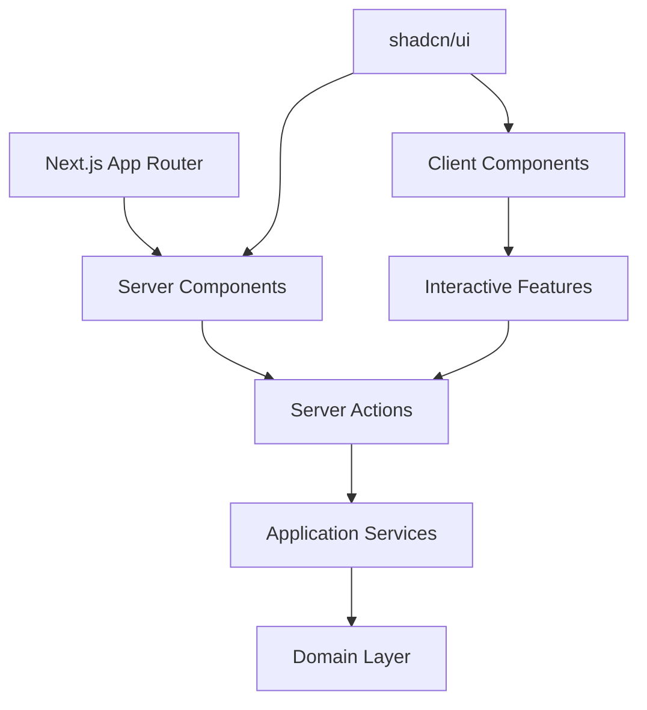
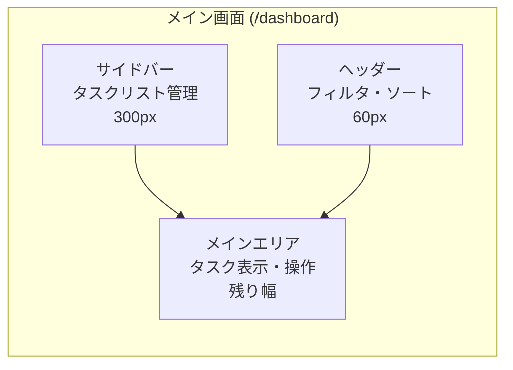
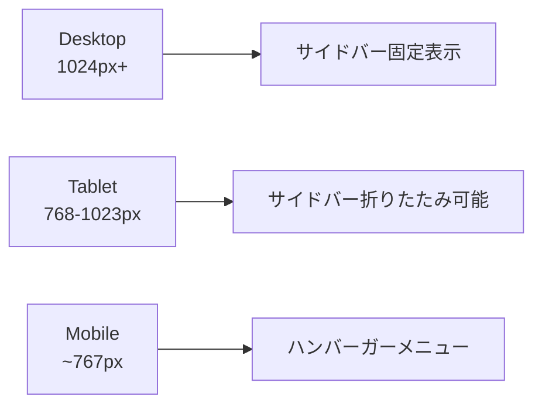

# UI層統合計画（Server Components + Server Actions版）

## 概要

アプリケーションサービス層の実装完了を受けて、React Server ComponentsとServer Actionsを中心としたUI層統合計画を策定。shadcn/uiを活用したモダンでクリーンなダッシュボード形式のUIを構築する。

## 1. アーキテクチャ構成



### 設計方針
- **Server Components**: 静的コンテンツとデータ表示
- **Client Components**: インタラクティブ機能のみに限定
- **Server Actions**: API Routesを使わず直接アプリケーションサービス呼び出し
- **URLパラメータ**: 状態管理とフィルタリング

## 2. Server Components vs Client Components分類

### Server Components（サーバーサイドレンダリング）
- **DashboardPage** - メインページレイアウト
- **TaskListSidebar** - タスクリスト一覧表示
- **TaskList** - タスク一覧表示
- **TaskItem** - 個別タスク表示（静的部分）
- **FilteredTaskList** - フィルタリング済みタスク表示

### Client Components（インタラクティブ機能のみ）
- **TaskDragDropContainer** - ドラッグ&ドロップ機能
- **TaskFormModal** - タスク作成・編集フォーム
- **TaskListFormModal** - タスクリスト作成・編集フォーム
- **SidebarToggle** - サイドバー開閉
- **FilterControls** - リアルタイムフィルタリング

## 3. Server Actions設計

### タスク関連Actions

```typescript
// app/actions/task-actions.ts
'use server'

import { createDependencyContainer } from '@/src/infrastructure/config/DependencyInjection';
import { revalidatePath } from 'next/cache';

export async function createTaskAction(formData: FormData) {
  const container = createDependencyContainer();
  const taskService = container.taskApplicationService;
  
  const result = await taskService.createTask({
    title: formData.get('title') as string,
    description: formData.get('description') as string,
    dueDate: formData.get('dueDate') as string,
    listId: formData.get('listId') as string,
  });
  
  revalidatePath('/dashboard');
  return result;
}

export async function updateTaskStatusAction(taskId: string, status: string) {
  const container = createDependencyContainer();
  const taskService = container.taskApplicationService;
  
  await taskService.changeTaskStatus(taskId, status as any);
  revalidatePath('/dashboard');
}

export async function moveTaskAction(taskId: string, newListId: string) {
  const container = createDependencyContainer();
  const taskService = container.taskApplicationService;
  
  await taskService.moveTaskToList(taskId, newListId);
  revalidatePath('/dashboard');
}
```

### タスクリスト関連Actions

```typescript
// app/actions/task-list-actions.ts
'use server'

export async function createTaskListAction(formData: FormData) {
  const container = createDependencyContainer();
  const taskListService = container.taskListApplicationService;
  
  const result = await taskListService.createTaskList({
    name: formData.get('name') as string,
  });
  
  revalidatePath('/dashboard');
  return result;
}

export async function deleteTaskListAction(listId: string) {
  const container = createDependencyContainer();
  const taskListService = container.taskListApplicationService;
  
  await taskListService.deleteTaskListWithTasks(listId);
  revalidatePath('/dashboard');
}
```

## 4. URL設計とSearchParams活用

```
/dashboard                           # デフォルト表示
/dashboard?list=:id                  # 特定タスクリスト選択
/dashboard?filter=:status            # ステータスフィルタ
/dashboard?sort=:order               # ソート順
/dashboard?list=:id&filter=:status   # 組み合わせ
```

## 5. メインページ構成

```typescript
// app/dashboard/page.tsx (Server Component)
interface DashboardPageProps {
  searchParams: {
    list?: string;
    filter?: string;
    sort?: string;
  };
}

export default async function DashboardPage({ searchParams }: DashboardPageProps) {
  const container = createDependencyContainer();
  const taskListService = container.taskListApplicationService;
  const taskService = container.taskApplicationService;
  
  // サーバーサイドでデータ取得
  const taskLists = await taskListService.getAllTaskLists();
  const selectedListId = searchParams.list || taskLists[0]?.id;
  
  let tasks = [];
  if (selectedListId) {
    if (searchParams.filter) {
      tasks = await taskService.getTasksByStatus(searchParams.filter);
    } else {
      tasks = await taskService.getTasksByListId(selectedListId);
    }
    
    if (searchParams.sort === 'dueDate') {
      tasks = await taskService.getTasksSortedByDueDate(true);
    }
  }
  
  return (
    <div className="flex h-screen">
      <TaskListSidebar 
        taskLists={taskLists} 
        selectedListId={selectedListId} 
      />
      <main className="flex-1">
        <DashboardHeader />
        <TaskDragDropContainer>
          <TaskList 
            tasks={tasks} 
            selectedListId={selectedListId}
            filter={searchParams.filter}
          />
        </TaskDragDropContainer>
      </main>
    </div>
  );
}
```

## 6. Client Component実装例

### ドラッグ&ドロップコンテナ

```typescript
// components/TaskDragDropContainer.tsx
'use client'

import { moveTaskAction } from '@/app/actions/task-actions';

export function TaskDragDropContainer({ children }: { children: React.ReactNode }) {
  const handleDrop = async (taskId: string, newListId: string) => {
    await moveTaskAction(taskId, newListId);
  };
  
  return (
    <div onDrop={handleDrop}>
      {children}
    </div>
  );
}
```

### フィルタリングコントロール

```typescript
// components/FilterControls.tsx
'use client'

import { useRouter, useSearchParams } from 'next/navigation';

export function FilterControls() {
  const router = useRouter();
  const searchParams = useSearchParams();
  
  const handleFilterChange = (status: string) => {
    const params = new URLSearchParams(searchParams);
    params.set('filter', status);
    router.push(`/dashboard?${params.toString()}`);
  };
  
  return (
    <div>
      <button onClick={() => handleFilterChange('TODO')}>TODO</button>
      <button onClick={() => handleFilterChange('IN_PROGRESS')}>進行中</button>
      <button onClick={() => handleFilterChange('DONE')}>完了</button>
    </div>
  );
}
```

## 7. ディレクトリ構造

```
app/
├── dashboard/
│   └── page.tsx                 # メインダッシュボード（Server Component）
├── actions/
│   ├── task-actions.ts          # タスク関連Server Actions
│   └── task-list-actions.ts     # タスクリスト関連Server Actions
└── globals.css

components/
├── server/                      # Server Components
│   ├── TaskList.tsx
│   ├── TaskItem.tsx
│   ├── TaskListSidebar.tsx
│   └── DashboardHeader.tsx
├── client/                      # Client Components
│   ├── TaskDragDropContainer.tsx
│   ├── TaskFormModal.tsx
│   ├── FilterControls.tsx
│   └── SidebarToggle.tsx
└── ui/                         # shadcn/ui components
    ├── button.tsx
    ├── card.tsx
    └── ...
```

## 8. 画面レイアウト設計

### ダッシュボード構成



### レスポンシブ対応



## 9. 状態管理戦略

### Server State（Server Components）
- URLパラメータによる状態管理
- `revalidatePath()`による再レンダリング
- サーバーサイドでのデータ取得

### Client State（最小限）
- フォームの入力状態
- UI状態（モーダル開閉、サイドバー表示）
- ドラッグ&ドロップの一時状態

## 10. ユースケースマッピング

| ユースケース | 実装方法 | コンポーネント |
|-------------|----------|---------------|
| UC001: タスク作成 | Server Action + Form | TaskFormModal |
| UC002: タスク一覧表示 | Server Component | TaskList |
| UC003: タスク詳細表示 | Server Component | TaskItem |
| UC004: タスク更新 | Server Action + Form | TaskFormModal |
| UC005: タスク削除 | Server Action | TaskItem |
| UC006-007: ステータス変更 | Server Action | TaskItem |
| UC008: ステータスフィルタ | URLパラメータ | FilterControls |
| UC009: 期日ソート | URLパラメータ | SortControls |
| UC010: タスクリスト作成 | Server Action + Form | TaskListFormModal |
| UC011: タスクリスト一覧 | Server Component | TaskListSidebar |
| UC012: リスト内タスク追加 | Server Action + Form | TaskFormModal |
| UC013: リスト内タスク表示 | Server Component | TaskList |
| UC014: リスト名変更 | Server Action + Form | TaskListFormModal |
| UC015: リスト削除 | Server Action | TaskListSidebar |
| UC016: タスク移動 | Client Component + Server Action | TaskDragDropContainer |

## 11. 実装フェーズ

### Phase 1: Server Components基盤
1. shadcn/ui セットアップ
2. 基本Server Components作成
3. Server Actions実装

### Phase 2: 基本機能
1. タスクリスト表示・作成・削除
2. タスク表示・作成・更新・削除
3. URLパラメータによるフィルタリング

### Phase 3: インタラクティブ機能
1. Client Componentsでドラッグ&ドロップ
2. リアルタイムフィルタリング
3. モーダル・フォーム機能

### Phase 4: 最適化・レスポンシブ
1. パフォーマンス最適化
2. モバイル対応
3. アクセシビリティ対応

## 12. 技術的利点

### パフォーマンス
- 初期ページロード高速化
- バンドルサイズ削減
- サーバーサイドレンダリングによるSEO最適化

### 開発体験
- 型安全性の維持
- 直接的なビジネスロジック呼び出し
- シンプルな状態管理

### 保守性
- Server/Client Componentsの明確な分離
- 単一責任原則の適用
- テスタビリティの向上

---

**作成日**: 2025年6月2日  
**対象**: TODOアプリケーション UI層統合  
**前提**: アプリケーションサービス層実装完了（16ユースケース）