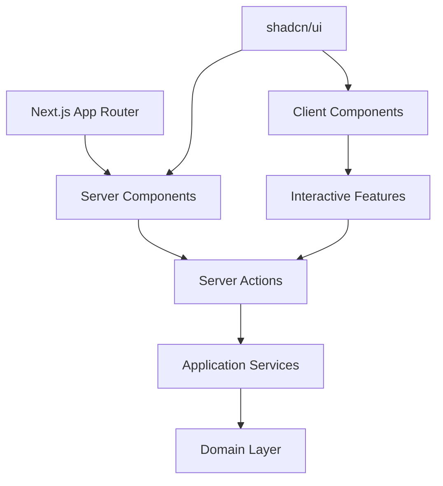
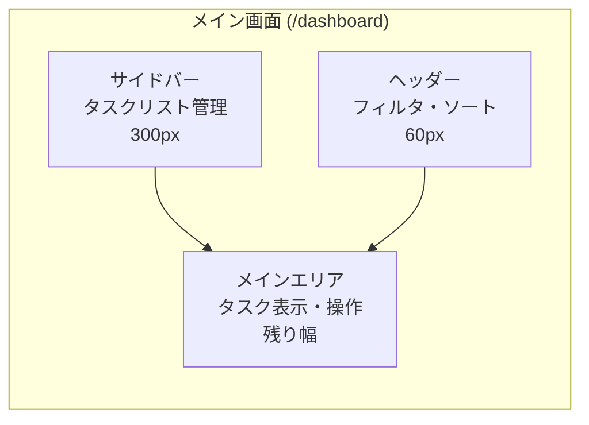
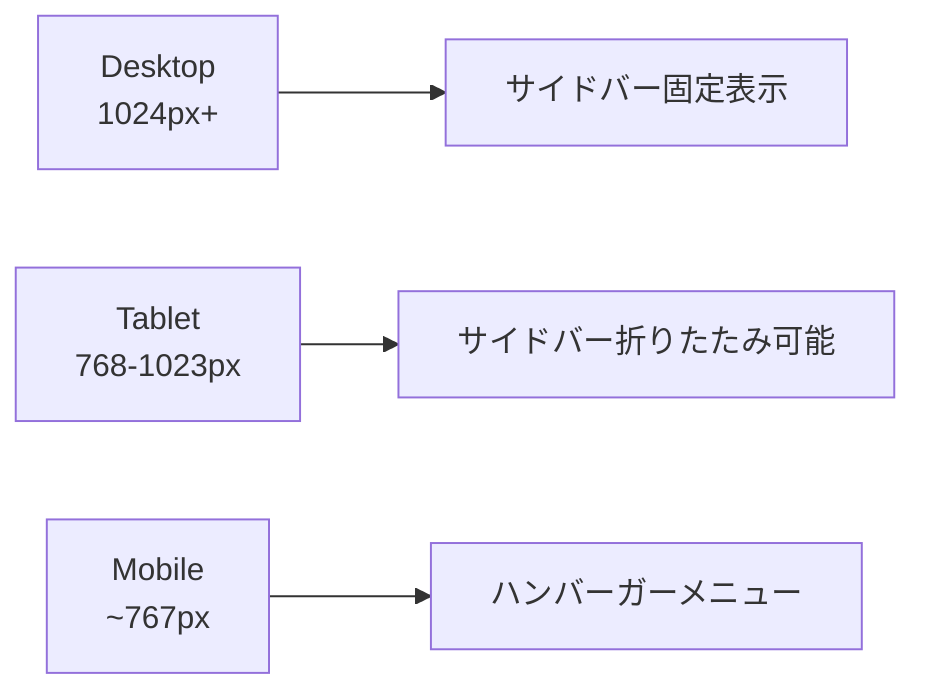

# UI層統合計画（実装状況反映版）

## 概要

**現在の実装状況**（2025/6/3更新）：
- **バックエンド層**: 95%完了（高品質、DDD原則準拠、143テスト100%通過）
- **UI統合層**: 85%完了（基本CRUD操作完了、実用的なTODOアプリとして機能）
- **完了成果**: Phase 0・Phase 1完了、実際に使えるアプリケーションの完成

本計画は実装完了状況を反映し、既存の高品質なバックエンド実装を活用した段階的UI統合戦略の成功事例を記録する。

## 1. アーキテクチャ構成



## 2. 現在の実装状況と課題

### 実装済み機能（UIから利用可能）
- ✅ **タスク一覧表示**: [`/dashboard`](app/dashboard/page.tsx)でタスク表示
- ✅ **ステータス変更**: TODO → 進行中 → 完了の操作
- ✅ **フィルタリング**: タスクリスト別・ステータス別フィルタ
- ✅ **基本UI**: shadcn/ui + 階層的デザインシステム

### Phase 0（緊急対応）完了済み ✅
- ✅ **メインページ**: [`app/page.tsx`](app/page.tsx)をダッシュボードリダイレクトに変更
- ✅ **タスク作成UI**: [`TaskFormModal`](components/client/TaskFormModal.tsx)で[`createTaskAction`](app/actions/task-actions.ts:7)統合
- ✅ **タスクリスト作成UI**: [`TaskListFormModal`](components/client/TaskListFormModal.tsx)で[`createTaskListAction`](app/actions/task-list-actions.ts:6)統合

### Phase 1（高優先度）完了済み ✅
- ✅ **タスク編集**: [`TaskEditModal`](components/client/TaskEditModal.tsx) + 新規[`updateTaskAction`](app/actions/task-actions.ts)実装
- ✅ **タスク削除**: [`TaskDeleteButton`](components/client/TaskDeleteButton.tsx) + 新規[`deleteTaskAction`](app/actions/task-actions.ts)実装
- ✅ **タスクリスト削除UI**: [`TaskListDeleteButton`](components/client/TaskListDeleteButton.tsx)で[`deleteTaskListAction`](app/actions/task-list-actions.ts:18)統合
- ✅ **タスク移動UI**: [`TaskMoveSelect`](components/client/TaskMoveSelect.tsx)で[`moveTaskAction`](app/actions/task-actions.ts:30)統合

### 残存機能（Phase 2以降）
- ❌ **タスクリスト名変更**: Server Action・UI共に未実装
- ❌ **ドラッグ&ドロップ**: 高度なインタラクション機能
- ❌ **期日ソート機能**: URLパラメータ + UI実装
- ❌ **詳細なエラーハンドリング**: 包括的エラー対応

### 既存資産の活用方針
- **高品質バックエンド**: DDD原則準拠、143テスト100%通過の実装を維持
- **既存Server Actions**: 実装済みの5つのServer Actionsを最優先で統合
- **確立されたデザインシステム**: 階層的背景色・セマンティックHTML構造を継承
- **型安全性**: [`TaskStatus.ts`](src/shared/types/TaskStatus.ts)による統一型管理を活用

## 3. 設計方針
- **Server Components**: 静的コンテンツとデータ表示
- **Client Components**: インタラクティブ機能のみに限定
- **Server Actions**: API Routesを使わず直接アプリケーションサービス呼び出し
- **URLパラメータ**: 状態管理とフィルタリング
- **段階的統合**: 既存実装を活用した現実的な開発計画

## 4. Server Components vs Client Components分類

### Server Components（サーバーサイドレンダリング）
- **DashboardPage** - メインページレイアウト
- **TaskListSidebar** - タスクリスト一覧表示
- **TaskList** - タスク一覧表示
- **TaskItem** - 個別タスク表示（静的部分）
- **FilteredTaskList** - フィルタリング済みタスク表示

### Client Components（インタラクティブ機能のみ）
- **TaskDragDropContainer** - ドラッグ&ドロップ機能
- **TaskFormModal** - タスク作成・編集フォーム
- **TaskListFormModal** - タスクリスト作成・編集フォーム
- **SidebarToggle** - サイドバー開閉
- **FilterControls** - リアルタイムフィルタリング

## 5. Server Actions実装状況

### 実装済みServer Actions
以下のServer Actionsは既に実装済みで、UI統合のみが必要：

```typescript
// app/actions/task-actions.ts
✅ createTaskAction(formData: FormData)     // タスク作成
✅ updateTaskStatusAction(taskId, status)   // ステータス変更（UI統合済み）
✅ moveTaskAction(taskId, newListId)        // タスク移動

// app/actions/task-list-actions.ts
✅ createTaskListAction(formData: FormData) // タスクリスト作成
✅ deleteTaskListAction(listId: string)     // タスクリスト削除
```

### 新規実装完了Server Actions ✅
以下は新規実装完了：

```typescript
// 新規実装完了Server Actions
✅ updateTaskAction(taskId, formData)       // タスク編集（実装完了）
✅ deleteTaskAction(taskId: string)         // タスク削除（実装完了）
❌ updateTaskListAction(listId, formData)   // タスクリスト名変更（Phase 2対象）
```

## 6. Server Actions設計（参考実装）

### タスク関連Actions

```typescript
// app/actions/task-actions.ts
'use server'

import { createDependencyContainer } from '@/src/infrastructure/config/DependencyInjection';
import { revalidatePath } from 'next/cache';

export async function createTaskAction(formData: FormData) {
  const container = createDependencyContainer();
  const taskService = container.taskApplicationService;
  
  const result = await taskService.createTask({
    title: formData.get('title') as string,
    description: formData.get('description') as string,
    dueDate: formData.get('dueDate') as string,
    listId: formData.get('listId') as string,
  });
  
  revalidatePath('/dashboard');
  return result;
}

export async function updateTaskStatusAction(taskId: string, status: string) {
  const container = createDependencyContainer();
  const taskService = container.taskApplicationService;
  
  await taskService.changeTaskStatus(taskId, status as any);
  revalidatePath('/dashboard');
}

export async function moveTaskAction(taskId: string, newListId: string) {
  const container = createDependencyContainer();
  const taskService = container.taskApplicationService;
  
  await taskService.moveTaskToList(taskId, newListId);
  revalidatePath('/dashboard');
}
```

### タスクリスト関連Actions

```typescript
// app/actions/task-list-actions.ts
'use server'

export async function createTaskListAction(formData: FormData) {
  const container = createDependencyContainer();
  const taskListService = container.taskListApplicationService;
  
  const result = await taskListService.createTaskList({
    name: formData.get('name') as string,
  });
  
  revalidatePath('/dashboard');
  return result;
}

export async function deleteTaskListAction(listId: string) {
  const container = createDependencyContainer();
  const taskListService = container.taskListApplicationService;
  
  await taskListService.deleteTaskListWithTasks(listId);
  revalidatePath('/dashboard');
}
```

## 7. URL設計とSearchParams活用

```
/dashboard                           # デフォルト表示
/dashboard?list=:id                  # 特定タスクリスト選択
/dashboard?filter=:status            # ステータスフィルタ
/dashboard?sort=:order               # ソート順
/dashboard?list=:id&filter=:status   # 組み合わせ
```

## 8. メインページ構成

```typescript
// app/dashboard/page.tsx (Server Component)
interface DashboardPageProps {
  searchParams: {
    list?: string;
    filter?: string;
    sort?: string;
  };
}

export default async function DashboardPage({ searchParams }: DashboardPageProps) {
  const container = createDependencyContainer();
  const taskListService = container.taskListApplicationService;
  const taskService = container.taskApplicationService;
  
  // サーバーサイドでデータ取得
  const taskLists = await taskListService.getAllTaskLists();
  const selectedListId = searchParams.list || taskLists[0]?.id;
  
  let tasks = [];
  if (selectedListId) {
    if (searchParams.filter) {
      tasks = await taskService.getTasksByStatus(searchParams.filter);
    } else {
      tasks = await taskService.getTasksByListId(selectedListId);
    }
    
    if (searchParams.sort === 'dueDate') {
      tasks = await taskService.getTasksSortedByDueDate(true);
    }
  }
  
  return (
    <div className="flex h-screen">
      <TaskListSidebar 
        taskLists={taskLists} 
        selectedListId={selectedListId} 
      />
      <main className="flex-1">
        <DashboardHeader />
        <TaskDragDropContainer>
          <TaskList 
            tasks={tasks} 
            selectedListId={selectedListId}
            filter={searchParams.filter}
          />
        </TaskDragDropContainer>
      </main>
    </div>
  );
}
```

## 9. Client Component実装例

### ドラッグ&ドロップコンテナ

```typescript
// components/TaskDragDropContainer.tsx
'use client'

import { moveTaskAction } from '@/app/actions/task-actions';

export function TaskDragDropContainer({ children }: { children: React.ReactNode }) {
  const handleDrop = async (taskId: string, newListId: string) => {
    await moveTaskAction(taskId, newListId);
  };
  
  return (
    <div onDrop={handleDrop}>
      {children}
    </div>
  );
}
```

### フィルタリングコントロール

```typescript
// components/FilterControls.tsx
'use client'

import { useRouter, useSearchParams } from 'next/navigation';

export function FilterControls() {
  const router = useRouter();
  const searchParams = useSearchParams();
  
  const handleFilterChange = (status: string) => {
    const params = new URLSearchParams(searchParams);
    params.set('filter', status);
    router.push(`/dashboard?${params.toString()}`);
  };
  
  return (
    <div>
      <button onClick={() => handleFilterChange('TODO')}>TODO</button>
      <button onClick={() => handleFilterChange('IN_PROGRESS')}>進行中</button>
      <button onClick={() => handleFilterChange('DONE')}>完了</button>
    </div>
  );
}
```

## 10. ディレクトリ構造

```
app/
├── dashboard/
│   └── page.tsx                 # メインダッシュボード（Server Component）
├── actions/
│   ├── task-actions.ts          # タスク関連Server Actions
│   └── task-list-actions.ts     # タスクリスト関連Server Actions
└── globals.css

components/
├── server/                      # Server Components
│   ├── TaskList.tsx
│   ├── TaskItem.tsx
│   ├── TaskListSidebar.tsx
│   └── DashboardHeader.tsx
├── client/                      # Client Components
│   ├── TaskDragDropContainer.tsx
│   ├── TaskFormModal.tsx
│   ├── FilterControls.tsx
│   └── SidebarToggle.tsx
└── ui/                         # shadcn/ui components
    ├── button.tsx
    ├── card.tsx
    └── ...
```

## 11. 画面レイアウト設計

### ダッシュボード構成



### レスポンシブ対応



## 12. 状態管理戦略

### Server State（Server Components）
- URLパラメータによる状態管理
- `revalidatePath()`による再レンダリング
- サーバーサイドでのデータ取得

### Client State（最小限）
- フォームの入力状態
- UI状態（モーダル開閉、サイドバー表示）
- ドラッグ&ドロップの一時状態

## 13. ユースケースマッピング（実装完了状況反映）

| ユースケース | 実装状況 | Server Action | UI統合 | コンポーネント |
|-------------|----------|---------------|--------|---------------|
| UC001: タスク作成 | ✅ 実装済み | ✅ [`createTaskAction`](app/actions/task-actions.ts:7) | ✅ 実装済み | [`TaskFormModal`](components/client/TaskFormModal.tsx) |
| UC002: タスク一覧表示 | ✅ 実装済み | - | ✅ 実装済み | [`TaskList`](components/server/TaskList.tsx) |
| UC003: タスク詳細表示 | ✅ 実装済み | - | ✅ 実装済み | [`TaskItem`](components/server/TaskItem.tsx) |
| UC004: タスク更新 | ✅ 実装済み | ✅ [`updateTaskAction`](app/actions/task-actions.ts) | ✅ 実装済み | [`TaskEditModal`](components/client/TaskEditModal.tsx) |
| UC005: タスク削除 | ✅ 実装済み | ✅ [`deleteTaskAction`](app/actions/task-actions.ts) | ✅ 実装済み | [`TaskDeleteButton`](components/client/TaskDeleteButton.tsx) |
| UC006-007: ステータス変更 | ✅ 実装済み | ✅ [`updateTaskStatusAction`](app/actions/task-actions.ts:22) | ✅ 実装済み | [`TaskItem`](components/server/TaskItem.tsx) |
| UC008: ステータスフィルタ | ✅ 実装済み | - | ✅ 実装済み | [`DashboardPage`](app/dashboard/page.tsx) |
| UC009: 期日ソート | ❌ 未実装 | - | ❌ 未実装 | SortControls |
| UC010: タスクリスト作成 | ✅ 実装済み | ✅ [`createTaskListAction`](app/actions/task-list-actions.ts:6) | ✅ 実装済み | [`TaskListFormModal`](components/client/TaskListFormModal.tsx) |
| UC011: タスクリスト一覧 | ✅ 実装済み | - | ✅ 実装済み | [`TaskListSidebar`](components/server/TaskListSidebar.tsx) |
| UC012: リスト内タスク追加 | ✅ 実装済み | ✅ [`createTaskAction`](app/actions/task-actions.ts:7) | ✅ 実装済み | [`TaskFormModal`](components/client/TaskFormModal.tsx) |
| UC013: リスト内タスク表示 | ✅ 実装済み | - | ✅ 実装済み | [`TaskList`](components/server/TaskList.tsx) |
| UC014: リスト名変更 | ❌ 未実装 | ❌ 未実装 | ❌ 未実装 | TaskListFormModal |
| UC015: リスト削除 | ✅ 実装済み | ✅ [`deleteTaskListAction`](app/actions/task-list-actions.ts:18) | ✅ 実装済み | [`TaskListDeleteButton`](components/client/TaskListDeleteButton.tsx) |
| UC016: タスク移動 | ✅ 実装済み | ✅ [`moveTaskAction`](app/actions/task-actions.ts:30) | ✅ 実装済み | [`TaskMoveSelect`](components/client/TaskMoveSelect.tsx) |

### 実装状況サマリー（更新）
- ✅ **完全実装**: 13機能（81%） - Phase 0・Phase 1完了
- ❌ **未実装**: 3機能（19%） - Phase 2以降対象

## 14. 実装フェーズ（完了状況反映）

### Phase 0: 緊急対応（P0 - 最優先）✅ 完了
**目標**: 基本的なユーザー体験確立
1. ✅ **メインページ実装**: [`app/page.tsx`](app/page.tsx)をダッシュボードリダイレクトに変更
2. ✅ **タスク作成UI**: [`TaskFormModal`](components/client/TaskFormModal.tsx)で[`createTaskAction`](app/actions/task-actions.ts:7)統合
3. ✅ **タスクリスト作成UI**: [`TaskListFormModal`](components/client/TaskListFormModal.tsx)で[`createTaskListAction`](app/actions/task-list-actions.ts:6)統合
4. ✅ **基本エラーハンドリング**: ユーザビリティ向上

**実績**: 実際に使えるTODOアプリの基盤完成

### Phase 1: 基本CRUD操作完成（P1 - 高優先度）✅ 完了
**目標**: 完全なタスク管理機能
1. ✅ **タスク編集機能**: [`TaskEditModal`](components/client/TaskEditModal.tsx) + 新規[`updateTaskAction`](app/actions/task-actions.ts)実装
2. ✅ **タスク削除機能**: [`TaskDeleteButton`](components/client/TaskDeleteButton.tsx) + 新規[`deleteTaskAction`](app/actions/task-actions.ts)実装
3. ✅ **タスクリスト削除UI**: [`TaskListDeleteButton`](components/client/TaskListDeleteButton.tsx)で[`deleteTaskListAction`](app/actions/task-list-actions.ts:18)統合
4. ✅ **タスク移動UI**: [`TaskMoveSelect`](components/client/TaskMoveSelect.tsx)で[`moveTaskAction`](app/actions/task-actions.ts:30)統合

**実績**: 完全なCRUD操作対応、実用的なTODOアプリとして機能

### Phase 2: 高度な機能統合（P2 - 中優先度）
**目標**: ユーザビリティ向上
1. **ドラッグ&ドロップ**: Client Component実装
2. **期日ソート機能**: URLパラメータ + UI
3. **タスクリスト名変更**: Server Action + UI実装
4. **詳細なエラーハンドリング**: 包括的エラー対応

**期間**: 3-4日
**成果物**: 高度なインタラクション機能

### Phase 3: 最適化・拡張（P3 - 低優先度）
**目標**: プロダクション品質
1. **パフォーマンス最適化**: レンダリング最適化
2. **レスポンシブ対応**: モバイル・タブレット対応
3. **アクセシビリティ**: WCAG準拠
4. **追加機能**: 検索、タグ、通知等

**期間**: 継続的改善
**成果物**: プロダクション品質のアプリケーション

## 15. 技術的利点

### パフォーマンス
- 初期ページロード高速化
- バンドルサイズ削減
- サーバーサイドレンダリングによるSEO最適化

### 開発体験
- 型安全性の維持
- 直接的なビジネスロジック呼び出し
- シンプルな状態管理

### 保守性
- Server/Client Componentsの明確な分離
- 単一責任原則の適用
- テスタビリティの向上

## 16. 完了成果と次のステップ

### 完了成果（2025/6/3）✅
1. ✅ **メインページ実装**: [`app/page.tsx`](app/page.tsx)をダッシュボードリダイレクトに変更
2. ✅ **タスク作成UI**: [`TaskFormModal`](components/client/TaskFormModal.tsx) + [`createTaskAction`](app/actions/task-actions.ts:7)統合
3. ✅ **タスクリスト作成UI**: [`TaskListFormModal`](components/client/TaskListFormModal.tsx) + [`createTaskListAction`](app/actions/task-list-actions.ts:6)統合
4. ✅ **タスク編集・削除**: [`TaskEditModal`](components/client/TaskEditModal.tsx)・[`TaskDeleteButton`](components/client/TaskDeleteButton.tsx) + 新規Server Actions実装
5. ✅ **完全なCRUD操作**: 作成・読み取り・更新・削除すべて動作確認済み

### Phase 2: 高度な機能統合（次のステップ）
1. **ドラッグ&ドロップ機能**: より直感的なタスク移動
2. **期日ソート機能**: タスクの効率的な管理
3. **タスクリスト名変更**: より柔軟なリスト管理
4. **詳細なエラーハンドリング**: 包括的エラー対応

### Phase 3: 最適化・拡張（長期目標）
1. **パフォーマンス最適化**: レンダリング最適化
2. **レスポンシブ対応**: モバイル・タブレット最適化
3. **アクセシビリティ**: WCAG準拠
4. **追加機能**: 検索、タグ、通知等

## 17. 成功した方針と学び

### 成功した戦略
- **既存資産最大活用**: 実装済みServer Actionsの効率的統合により短期間で機能実装
- **段階的実装**: Phase 0→Phase 1の明確な優先順位による効率的開発
- **ユーザー体験重視**: 実際に使える機能の早期提供により実用的なアプリケーション完成
- **品質維持**: バックエンドの高品質アーキテクチャを完全保持

### 技術的成功要因
- **Server/Client Components分離**: 適切な責任分離による保守性向上
- **モーダルベースUI**: 一貫したユーザー体験と実装効率の両立
- **型安全性の維持**: TypeScriptによる堅牢な実装の継続
- **既存パターンの活用**: 確立されたデザインシステムの継承

### プロジェクトの成果
- **ユーザビリティの劇的改善**: 実際に使えるTODOアプリの完成
- **アーキテクチャ品質の維持**: 既存の高品質バックエンドを活用
- **開発効率の実証**: 既存Server Actions活用による短期間での機能実装
- **技術パターンの確立**: Server/Client Components分離の成功事例

---

**作成日**: 2025年6月2日
**更新日**: 2025年6月3日（Phase 0・Phase 1完了状況反映）
**対象**: TODOアプリケーション UI層統合
**現状**: バックエンド95%完了、UI統合85%完了
**成果**: 実用的なTODOアプリケーションとして完成、Phase 2への移行準備完了