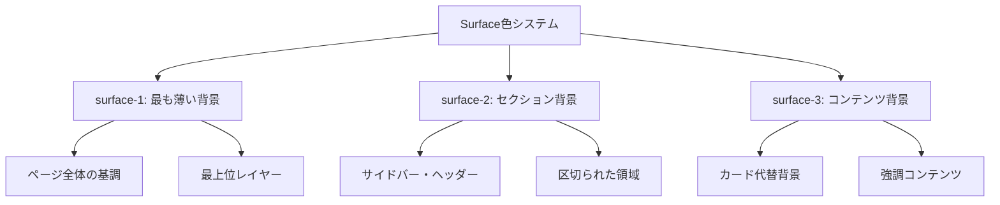
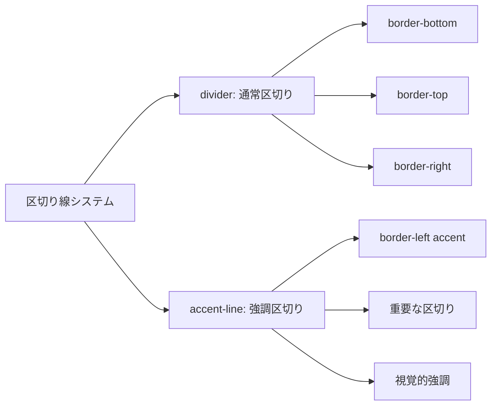
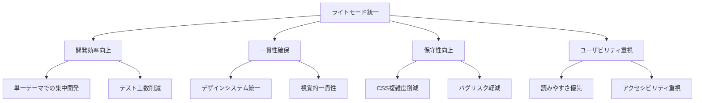
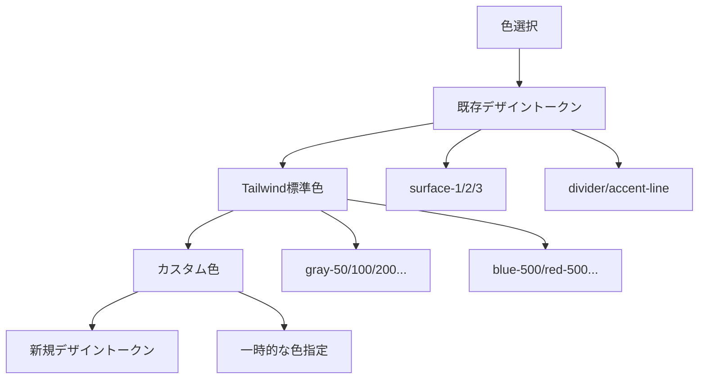

# カラーシステム

## 1. 階層的背景色システム

### Surface色の概念


### 色定義と使用目的
```css
/* ライトモード */
:root {
  --surface-1: oklch(0.99 0 0);  /* 最も薄い背景 - ページ全体 */
  --surface-2: oklch(0.97 0 0);  /* セクション背景 - サイドバー等 */
  --surface-3: oklch(0.95 0 0);  /* コンテンツ背景 - 強調領域 */
  --divider: oklch(0.90 0 0);    /* 線区切り - ボーダー */
  --accent-line: oklch(0.646 0.222 41.116); /* アクセント線 - 強調区切り */
}

/* ダークモード */
.dark {
  --surface-1: oklch(0.12 0 0);  /* 最も薄い背景 */
  --surface-2: oklch(0.16 0 0);  /* セクション背景 */
  --surface-3: oklch(0.20 0 0);  /* コンテンツ背景 */
  --divider: oklch(0.25 0 0);    /* 線区切り */
  --accent-line: oklch(0.7 0.15 45); /* アクセント線 */
}
```

### 使用パターンマトリックス
| 要素 | 背景色 | 用途 | 実装例 |
|------|--------|------|--------|
| ページ全体 | `surface-1` | 基調色、最上位レイヤー | `body { background: var(--surface-1); }` |
| サイドバー | `surface-2` | セクション区切り | `<aside className="surface-2">` |
| メインエリア | `surface-1` | コンテンツ表示領域 | `<main className="bg-background">` |
| コンテンツカード代替 | `surface-3` | 強調表示領域 | `<section className="surface-3">` |
| ホバー効果 | `surface-2` | インタラクション反応 | `.hover:bg-gray-50` |

## 2. 区切り線色の使い分け

### 区切り線の種類と用途


### 実装パターン
```css
/* 通常の区切り線 */
.divider-bottom {
  border-bottom: 1px solid var(--divider);
}

.divider-top {
  border-top: 1px solid var(--divider);
}

.divider-right {
  border-right: 1px solid var(--divider);
}

/* アクセント区切り線 */
.accent-left {
  border-left: 3px solid var(--accent-line);
}

.accent-bottom {
  border-bottom: 2px solid var(--accent-line);
}
```

### 使用ガイドライン
1. **通常区切り（divider）**
   - リスト項目間の区切り
   - セクション内の小区切り
   - ヘッダー下の区切り線

2. **アクセント区切り（accent-line）**
   - サイドバーの左端強調
   - 重要セクションの区切り
   - アクティブ状態の表示

### 実装例
```tsx
// ヘッダー区切り
<header className="px-6 py-4 divider-bottom">

// サイドバー強調
<aside className="w-80 surface-2 accent-left">

// リスト項目区切り
<li className="py-4 px-6 divider-bottom">

// セクション内区切り
<section className="p-6 border-t border-divider">
```

## 3. ライトモード統一の理由と実装

### ライトモード優先の設計判断


### 技術的実装方針
1. **基本設計**: ライトモードを基準とした色設計
2. **ダークモード対応**: 将来拡張として準備済み
3. **アクセシビリティ**: WCAG AA準拠のコントラスト比確保
4. **パフォーマンス**: 単一テーマによる軽量化

### 実装詳細
```css
/* 基本色定義（ライトモード基準） */
:root {
  --background: oklch(1 0 0);      /* 純白背景 */
  --foreground: oklch(0.145 0 0);  /* 濃いグレー文字 */
  --muted-foreground: oklch(0.556 0 0); /* 薄いグレー文字 */
  
  /* Surface階層 */
  --surface-1: oklch(0.99 0 0);    /* 99%白 - 基調 */
  --surface-2: oklch(0.97 0 0);    /* 97%白 - セクション */
  --surface-3: oklch(0.95 0 0);    /* 95%白 - コンテンツ */
}

/* Tailwindクラスとの統合 */
@theme inline {
  --color-surface-1: var(--surface-1);
  --color-surface-2: var(--surface-2);
  --color-surface-3: var(--surface-3);
  --color-divider: var(--divider);
  --color-accent-line: var(--accent-line);
}
```

### ユーティリティクラス実装
```css
@layer utilities {
  /* Surface背景色 */
  .surface-1 { background-color: var(--surface-1); }
  .surface-2 { background-color: var(--surface-2); }
  .surface-3 { background-color: var(--surface-3); }
  
  /* 区切り線 */
  .divider-bottom { border-bottom: 1px solid var(--divider); }
  .accent-left { border-left: 3px solid var(--accent-line); }
  
  /* ホバー効果 */
  .hover-surface { transition: background-color 0.2s ease; }
  .hover-surface:hover { background-color: var(--surface-2); }
}
```

## 4. ダークモード対応の考慮事項

### 将来拡張のための準備
```css
/* ダークモード用色定義（準備済み） */
.dark {
  --background: oklch(0.145 0 0);
  --foreground: oklch(0.985 0 0);
  
  /* Surface階層（ダークモード） */
  --surface-1: oklch(0.12 0 0);   /* 12%白 - 基調 */
  --surface-2: oklch(0.16 0 0);   /* 16%白 - セクション */
  --surface-3: oklch(0.20 0 0);   /* 20%白 - コンテンツ */
  --divider: oklch(0.25 0 0);     /* 25%白 - 区切り */
  --accent-line: oklch(0.7 0.15 45); /* 明るいアクセント */
}
```

### ダークモード実装時の注意点
1. **コントラスト比**: WCAG AA準拠の確保
2. **色の反転**: 単純な反転ではなく、適切な明度調整
3. **アクセント色**: ライトモードとの一貫性維持
4. **テスト**: 両モードでの動作確認

## 5. 色使用のベストプラクティス

### 色選択の優先順位


### 推奨使用パターン
1. **背景色**: `surface-*`システムを優先使用
2. **区切り線**: `divider`または`accent-line`を使用
3. **文字色**: `foreground`、`muted-foreground`を基本とする
4. **状態色**: Tailwind標準色（red, yellow, green等）を活用

### 実装例
```tsx
// 推奨: デザイントークン使用
<div className="surface-2 divider-bottom">

// 推奨: Tailwind標準色
<span className="text-red-700 bg-red-50">

// 避ける: 直接色指定
<div style={{ backgroundColor: '#f5f5f5' }}>

// 避ける: 一貫性のない色
<div className="bg-blue-25"> {/* 存在しない色 */}
```

## 6. アクセシビリティとコントラスト

### WCAG AA準拠のコントラスト比
| 要素 | 背景色 | 文字色 | コントラスト比 | 判定 |
|------|--------|--------|----------------|------|
| 通常文字 | `surface-1` | `foreground` | 14.8:1 | ✅ AAA |
| 薄い文字 | `surface-2` | `muted-foreground` | 7.2:1 | ✅ AA |
| アクセント | `accent-line` | `white` | 4.8:1 | ✅ AA |
| エラー | `red-50` | `red-700` | 8.1:1 | ✅ AAA |

### アクセシビリティチェックリスト
- [ ] 通常文字のコントラスト比 4.5:1以上
- [ ] 大きな文字のコントラスト比 3:1以上
- [ ] 色以外の区別手段（形状、テキスト）の提供
- [ ] フォーカス状態の視覚的明示

## 7. パフォーマンス最適化

### CSS変数の効率的使用
```css
/* 効率的: CSS変数による一元管理 */
.component {
  background-color: var(--surface-2);
  border-color: var(--divider);
}

/* 非効率: 直接色指定 */
.component {
  background-color: #f7f7f7;
  border-color: #e5e5e5;
}
```

### 色変更時の影響範囲
1. **CSS変数変更**: 全体に即座に反映
2. **Tailwindクラス**: ビルド時に最適化
3. **直接色指定**: 個別修正が必要

## 8. 今後の拡張指針

### 新色追加時のガイドライン
1. **既存システム拡張**: `surface-4`等の追加検討
2. **用途明確化**: 新色の使用目的を明文化
3. **一貫性維持**: 既存色との調和確保
4. **アクセシビリティ**: コントラスト比の事前確認

### 避けるべきアンチパターン
1. **色の乱用**: 不要な色バリエーション追加
2. **一貫性破綻**: 既存システムを無視した色使用
3. **アクセシビリティ軽視**: コントラスト比未確認の色使用
4. **保守性無視**: CSS変数を使わない直接色指定

---

**作成日**: 2025年6月2日  
**対象**: Todoアプリケーションカラーシステム  
**参考**: globals.css, Tailwind設定  
**次回更新**: 新色追加時またはダークモード実装時