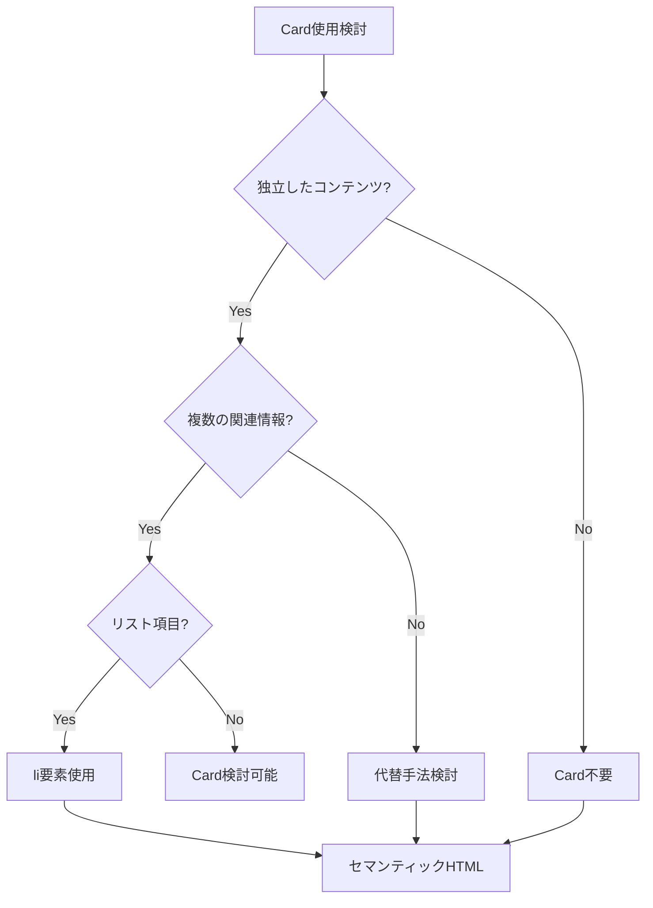
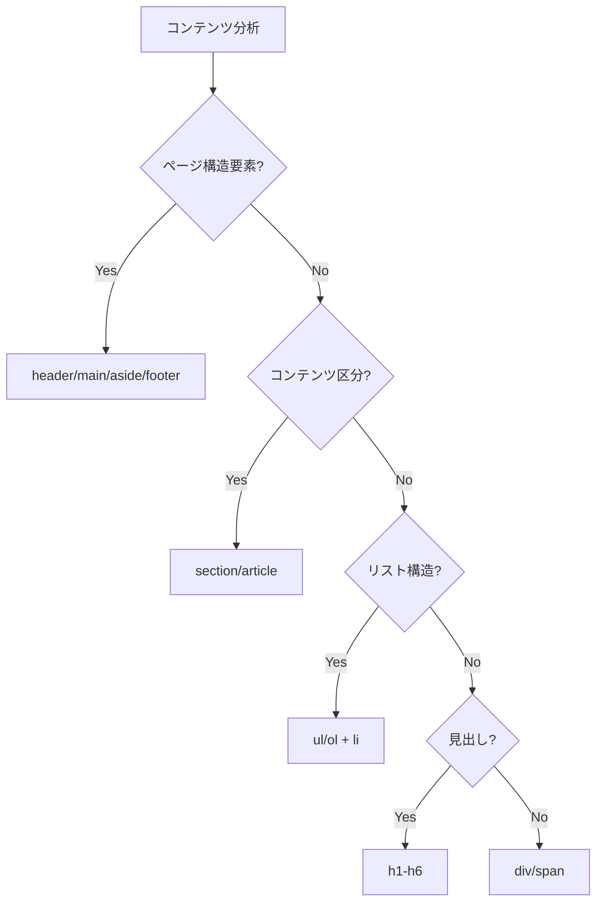

# コンポーネント設計指針

## 1. Card削除戦略とその代替手法

### Card削除の判断基準


### 代替手法マトリックス
| 用途 | 従来手法 | 新手法 | 効果 |
|------|----------|--------|------|
| ページヘッダー | Card wrapper | `<header>` + `divider-bottom` | DOM削減、意味的正確性 |
| サイドバー | 複数Card | `<aside>` + `accent-left` | 構造統一、視覚的調和 |
| コンテンツ領域 | Card container | `<section>` + `surface-*` | 軽量化、階層明確化 |
| リスト項目 | Card per item | `<li>` + `border-bottom` | 大幅軽量化、リスト構造 |

## 2. 具体的改善例

### 2.1 TaskItem改善例（最重要パターン）

#### ビフォー（Card使用）
```tsx
// 改善前: Card過剰使用パターン
import { Card, CardHeader, CardContent } from '../ui/card';

export function TaskItem({ task }: TaskItemProps) {
  return (
    <Card className="mb-4 shadow-sm hover:shadow-md transition-shadow">
      <CardHeader className="pb-2">
        <h3 className="text-lg font-medium">{task.title}</h3>
      </CardHeader>
      <CardContent>
        <p className="text-gray-600 mb-3">{task.description}</p>
        <div className="flex justify-between items-center">
          <span className="text-sm text-gray-500">
            期限: {task.dueDate}
          </span>
          <Button>{nextStatus.label}</Button>
        </div>
      </CardContent>
    </Card>
  );
}
```

**問題点:**
- 不要なWrapper要素（Card, CardHeader, CardContent）
- 重複する余白設定（Card内padding + 外側margin）
- リスト構造の意味的不正確性
- DOM要素の肥大化

#### アフター（li要素化）
```tsx
// 改善後: セマンティックHTML + 線区切りパターン
export function TaskItem({ task }: TaskItemProps) {
  return (
    <li className="py-4 px-6 hover:bg-gray-50 dark:hover:bg-gray-700 transition-colors duration-200">
      <div className="flex items-start justify-between gap-4">
        <div className="flex-1 min-w-0">
          <h3 className="text-lg font-medium text-gray-900 dark:text-white mb-2">
            {task.title}
          </h3>
          
          {task.description && (
            <p className="text-gray-600 dark:text-gray-300 mb-3 text-sm leading-relaxed">
              {task.description}
            </p>
          )}
          
          {task.dueDate && (
            <p className="text-sm text-gray-500 dark:text-gray-400 mb-3">
              期限: {new Date(task.dueDate).toLocaleDateString('ja-JP')}
            </p>
          )}

          <div className="flex items-center gap-3">
            <form action={updateTaskStatusAction.bind(null, task.id, nextStatus.value)}>
              <Button type="submit" size="sm" variant="outline">
                {nextStatus.label}
              </Button>
            </form>
          </div>
        </div>
        
        <div className="flex-shrink-0">
          <span className={`inline-flex items-center px-3 py-1 rounded-full text-xs font-medium border ${getStatusColor(task.status)}`}>
            {statusLabel}
          </span>
        </div>
      </div>
    </li>
  );
}
```

**改善効果:**
- DOM要素数: 約40%削減
- セマンティックHTML: `<li>`要素による正確なリスト構造
- 軽量ホバー効果: `hover:bg-gray-50`による控えめなフィードバック
- アクセシビリティ向上: スクリーンリーダー対応改善

### 2.2 DashboardHeader改善例（基本パターン）

#### ビフォー（Card使用）
```tsx
// 改善前: 不要なCard wrapper
import { Card, CardHeader, CardContent } from '../ui/card';

export function DashboardHeader() {
  return (
    <Card className="mb-6">
      <CardHeader>
        <h1 className="text-2xl font-bold">タスク管理ダッシュボード</h1>
      </CardHeader>
      <CardContent>
        <p className="text-gray-600">
          タスクを効率的に管理し、プロジェクトを成功に導きましょう。
        </p>
      </CardContent>
    </Card>
  );
}
```

#### アフター（header要素化）
```tsx
// 改善後: セマンティックheader + タイポグラフィ重視
export function DashboardHeader() {
  return (
    <header className="px-6 py-4 divider-bottom">
      <h1 className="text-display text-foreground mb-2">
        タスク管理ダッシュボード
      </h1>
      <p className="text-body text-muted-foreground">
        タスクを効率的に管理し、プロジェクトを成功に導きましょう。
      </p>
    </header>
  );
}
```

**改善ポイント:**
- セマンティック要素: `<header>`による意味的正確性
- タイポグラフィスケール: `text-display`, `text-body`活用
- 線区切り: `divider-bottom`による清潔な区切り
- 不要要素削除: Card関連要素の完全除去

### 2.3 TaskListSidebar改善例（統合パターン）

#### ビフォー（複数Card）
```tsx
// 改善前: 2つのCard分離
export function TaskListSidebar() {
  return (
    <div className="w-80 p-4">
      <Card className="mb-4">
        <CardHeader>
          <h2>タスクリスト</h2>
        </CardHeader>
        <CardContent>
          {/* タスクリスト内容 */}
        </CardContent>
      </Card>
      
      <Card>
        <CardHeader>
          <h2>フィルター</h2>
        </CardHeader>
        <CardContent>
          {/* フィルター内容 */}
        </CardContent>
      </Card>
    </div>
  );
}
```

#### アフター（統合aside）
```tsx
// 改善後: 統一サイドバー + セクション区切り
export function TaskListSidebar() {
  return (
    <aside className="w-80 surface-2 accent-left">
      <section className="p-6">
        <h2 className="text-heading text-foreground mb-4">タスクリスト</h2>
        {/* タスクリスト内容 */}
      </section>
      
      <section className="p-6 border-t border-divider">
        <h2 className="text-subheading text-foreground mb-4">フィルター</h2>
        {/* フィルター内容 */}
      </section>
    </aside>
  );
}
```

**統合効果:**
- 構造統一: 1つの`<aside>`による論理的統合
- 視覚的調和: `accent-left`による一貫した区切り
- セクション区切り: `border-t`による内部区切り
- 階層明確化: `surface-2`による背景色区別

## 3. セマンティックHTML活用指針

### HTML要素選択ガイド


### セマンティック要素マッピング
| 用途 | 推奨要素 | 理由 | 例 |
|------|----------|------|-----|
| ページヘッダー | `<header>` | ページ/セクションの導入部 | DashboardHeader |
| サイドバー | `<aside>` | 補助的コンテンツ | TaskListSidebar |
| メインコンテンツ | `<main>` | 主要コンテンツ領域 | TaskList表示エリア |
| コンテンツ区分 | `<section>` | テーマ別コンテンツグループ | タスクリスト、フィルター |
| リスト項目 | `<ul>` + `<li>` | 項目の列挙 | TaskItem一覧 |
| 見出し | `<h1>`-`<h6>` | 階層的見出し | ページタイトル、セクション名 |

### アクセシビリティ考慮事項
1. **ランドマーク要素**: `header`, `main`, `aside`による画面構造明確化
2. **見出し階層**: `h1`→`h2`→`h3`の論理的順序
3. **リスト構造**: `ul`+`li`による項目関係の明示
4. **フォーカス管理**: キーボードナビゲーション対応

## 4. ホバー効果とインタラクション設計

### 軽量インタラクション原則
1. **控えめなフィードバック**: 過度でない適切な反応
2. **一貫したパターン**: 同種要素での統一された効果
3. **パフォーマンス重視**: GPU加速対応のプロパティ使用
4. **アクセシビリティ配慮**: `prefers-reduced-motion`対応

### ホバー効果パターン
```css
/* パターン1: 背景色変化（推奨） */
.hover-surface {
  transition: background-color 0.2s ease;
}
.hover-surface:hover {
  background-color: var(--surface-2);
}

/* パターン2: ボーダー強調 */
.hover-border:hover {
  border-color: var(--accent-line);
}

/* パターン3: 軽微な影効果（慎重使用） */
.hover-shadow:hover {
  box-shadow: 0 1px 3px 0 rgb(0 0 0 / 0.1);
}
```

### インタラクション実装例
```tsx
// TaskItem: 軽量ホバー効果
<li className="py-4 px-6 hover:bg-gray-50 dark:hover:bg-gray-700 transition-colors duration-200">

// Button: 状態変化
<Button className="hover:bg-primary/90 transition-colors">

// Link: アンダーライン効果
<a className="hover:underline transition-all duration-200">
```

## 5. コンポーネント設計チェックリスト

### 設計前チェック
- [ ] Card使用の必要性を検証したか？
- [ ] 適切なセマンティック要素を選択したか？
- [ ] 既存デザイントークンを活用できるか？
- [ ] アクセシビリティ要件を満たすか？

### 実装中チェック
- [ ] 不要なWrapper要素を削除したか？
- [ ] 一貫したクラス命名を使用したか？
- [ ] レスポンシブ対応を考慮したか？
- [ ] ホバー効果は適切か？

### 実装後チェック
- [ ] DOM構造が簡潔か？
- [ ] CSS複雑度が適切か？
- [ ] 既存機能が保持されているか？
- [ ] パフォーマンスに悪影響がないか？

## 6. 今後の拡張パターン

### 新コンポーネント作成指針
1. **セマンティックファースト**: HTML要素の意味から設計開始
2. **デザイントークン活用**: 既存の色・タイポグラフィシステム使用
3. **軽量実装**: 最小限の要素で最大の効果
4. **一貫性維持**: 既存パターンとの調和

### 避けるべきアンチパターン
1. **Card乱用**: 全要素をCardで囲む安易なアプローチ
2. **div過多**: 意味のないWrapper要素の追加
3. **インライン装飾**: 一貫性を損なう個別スタイル
4. **アクセシビリティ軽視**: 見た目優先の実装

---

**作成日**: 2025年6月2日  
**対象**: TodoアプリケーションUIコンポーネント  
**参考実装**: TaskItem.tsx, DashboardHeader.tsx, TaskListSidebar.tsx  
**次回更新**: 新コンポーネント追加時または設計パターン変更時