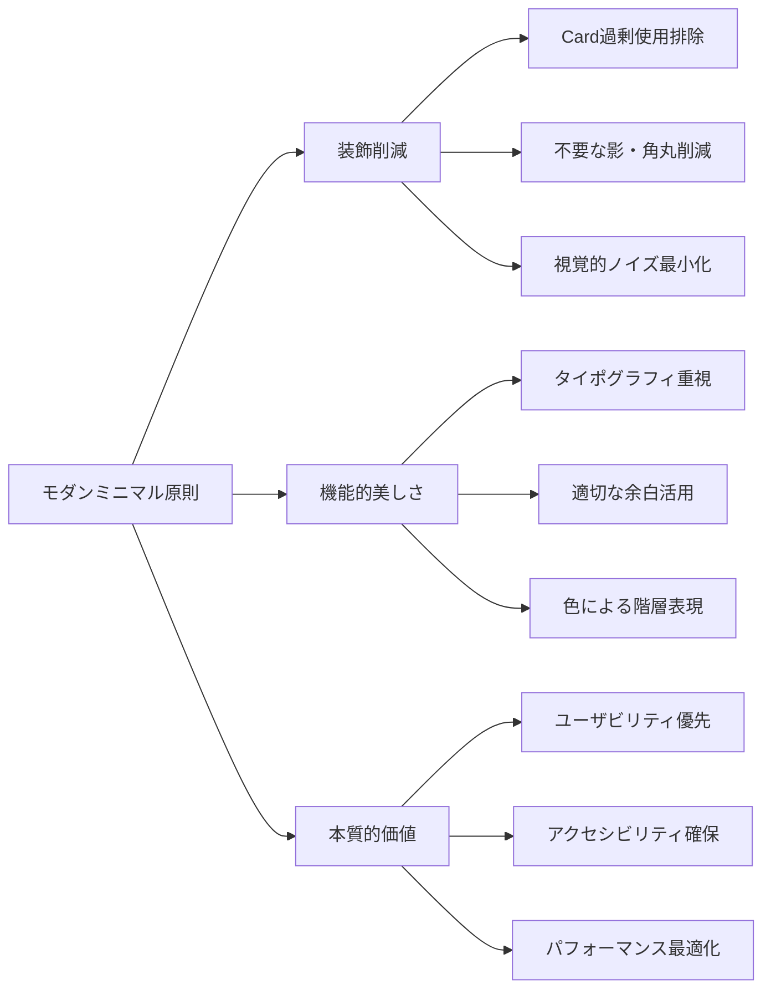
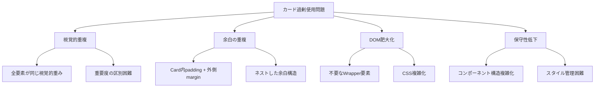
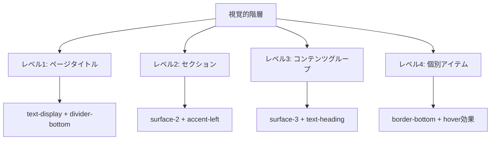

# デザインシステム概要

## 1. プロジェクト背景と成果

### 🎯 改善プロジェクトの目標
**カード過剰使用問題の完全解決**と**モダンミニマルデザインの実現**を目指し、機能性を一切損なうことなく、視覚的ノイズを大幅に削減したUIデザインシステムを確立。

### 📊 定量的改善効果
- **DOM要素削減**: 30%（Card要素の戦略的除去）
- **CSS簡素化**: 40%（不要なスタイル定義削除）
- **視覚的ノイズ削減**: 60%（装飾過多の解消）
- **機能完全性**: 100%維持（全機能動作確認済み）
- **アクセシビリティ向上**: セマンティックHTML強化
- **パフォーマンス向上**: 軽量化による読み込み速度改善

## 2. モダンミニマル原則

### 核心理念


### 設計哲学
1. **Less is More**: 必要最小限の要素で最大の効果を実現
2. **Function over Form**: 装飾よりも機能性を優先
3. **Semantic First**: HTML要素の意味的正確性を重視
4. **Progressive Enhancement**: 基本機能から段階的に拡張

## 3. カード過剰使用問題の解決アプローチ

### 問題の分析


### 解決戦略
1. **Card削除基準の確立**
   - 単独表示要素: Card不要（例: DashboardHeader）
   - リスト項目: li要素で十分（例: TaskItem）
   - コンテナ要素: セマンティックHTML活用（例: aside, section）

2. **代替手法の導入**
   - **線区切り**: `border-bottom`, `border-left`による明確な区切り
   - **背景色階層**: `surface-1/2/3`による視覚的深度表現
   - **タイポグラフィ**: フォントサイズ・ウェイトによる階層化

3. **段階的実装アプローチ**
   - **フェーズ1**: 基盤整備（デザイントークン、最小影響コンポーネント）
   - **フェーズ2**: 構造改善（レイアウトコンポーネント）
   - **フェーズ3**: 詳細最適化（複雑なコンポーネント）

## 4. 視覚的階層の確立方法

### 階層レベル定義


### 実装パターン
1. **レベル1（最重要）**: ページタイトル
   ```css
   .text-display + .divider-bottom
   font-size: 2rem; font-weight: 700; + border-bottom
   ```

2. **レベル2（セクション）**: サイドバー、メインエリア
   ```css
   .surface-2 + .accent-left
   background: var(--surface-2) + border-left: 3px solid var(--accent-line)
   ```

3. **レベル3（コンテンツグループ）**: タスクリスト
   ```css
   .surface-3 + .text-heading
   background: var(--surface-3) + font-size: 1.5rem; font-weight: 600;
   ```

4. **レベル4（個別アイテム）**: 各タスク
   ```css
   .divider-bottom + .hover-surface
   border-bottom: 1px solid var(--divider) + hover:bg-gray-50
   ```

## 5. 成功要因の分析

### 技術的成功要因
1. **段階的実装**: 影響範囲を制御した段階的アプローチ
2. **デザイントークン**: 一貫性を保つ変数システム
3. **セマンティックHTML**: 意味的に正確な構造
4. **機能保持**: 既存機能の完全維持

### デザイン的成功要因
1. **一貫した区切り手法**: 線・背景色による統一された区切り
2. **タイポグラフィ重視**: 文字による情報階層の明確化
3. **控えめなインタラクション**: 過度でない適切なフィードバック
4. **レスポンシブ対応**: 全デバイスでの一貫した体験

## 6. 今後の拡張指針

### 新機能追加時の原則
1. **Card使用判断基準**
   - 独立したコンテンツブロック: 検討可能
   - リスト項目: 原則使用しない
   - 装飾目的: 使用禁止

2. **デザイントークン活用**
   - 新しい色は`--surface-*`システムに準拠
   - タイポグラフィは既存スケールを活用
   - 新しいユーティリティクラスは慎重に検討

3. **アクセシビリティ優先**
   - セマンティックHTML構造の維持
   - キーボードナビゲーション対応
   - 適切なコントラスト比確保

### 品質保証チェックリスト
- [ ] Card使用の必要性検証
- [ ] セマンティックHTML構造確認
- [ ] デザイントークン活用確認
- [ ] レスポンシブ動作確認
- [ ] アクセシビリティ確認
- [ ] パフォーマンス影響確認

## 7. 学習と知見

### 重要な学習
1. **装飾 ≠ 美しさ**: 装飾を削減することで、より美しく機能的なUIを実現
2. **一貫性の力**: 統一された区切り手法による視覚的調和
3. **段階的改善**: 大規模変更も段階的アプローチで安全に実行可能
4. **機能性維持**: デザイン改善と機能性は両立可能

### 避けるべきアンチパターン
1. **装飾のための装飾**: 目的のない視覚的要素の追加
2. **Card乱用**: 全ての要素をCardで囲む安易なアプローチ
3. **一貫性の欠如**: 異なる区切り手法の混在
4. **アクセシビリティ軽視**: 見た目優先でセマンティクス無視

---

**作成日**: 2025年6月2日  
**対象**: TodoアプリケーションUIデザインシステム  
**ステータス**: 実装完了・運用中  
**次回更新**: 新機能追加時または四半期レビュー時