# 実装パターン

## 1. 成功した改善パターンの記録

### パターン1: Card削除 → セマンティック要素化
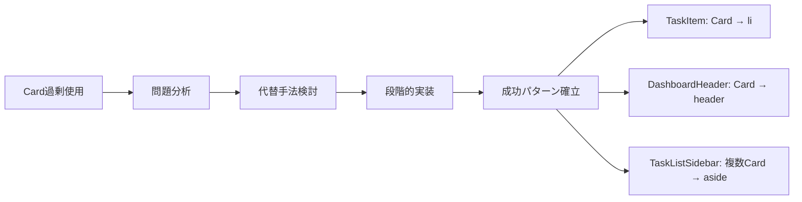

#### 実装手順
1. **問題特定**: Card使用の必要性を検証
2. **代替設計**: 適切なセマンティック要素を選択
3. **段階的移行**: 影響範囲を制御した実装
4. **機能確認**: 既存機能の完全保持確認
5. **最適化**: 余白・スタイルの調整

#### 成功要因
- **明確な判断基準**: Card使用の必要性を体系的に評価
- **代替手法の準備**: 線区切り・背景色による代替手法
- **段階的アプローチ**: リスクを最小化した実装順序
- **機能保持**: デザイン改善と機能性の両立

### パターン2: 階層的背景色システム
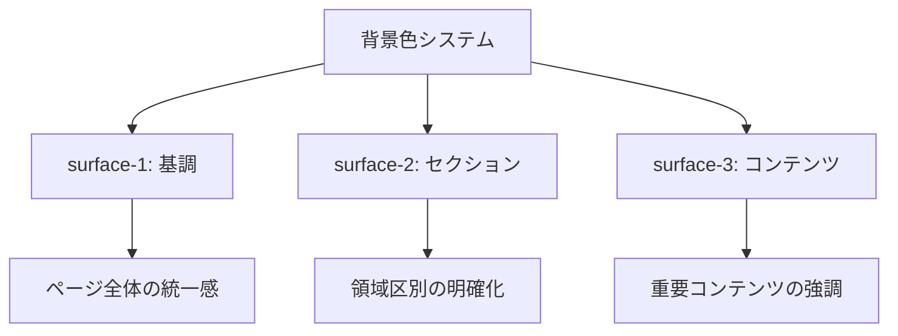

#### 実装詳細
```css
/* 成功パターン: 階層的背景色 */
:root {
  --surface-1: oklch(0.99 0 0);  /* 最も薄い - 基調 */
  --surface-2: oklch(0.97 0 0);  /* 中間 - セクション */
  --surface-3: oklch(0.95 0 0);  /* 最も濃い - コンテンツ */
}

/* 使用例 */
.page-background { background: var(--surface-1); }
.sidebar-background { background: var(--surface-2); }
.content-highlight { background: var(--surface-3); }
```

#### 効果測定
- **視覚的階層**: 明確な深度表現の実現
- **一貫性**: 全体的な調和の確保
- **保守性**: CSS変数による一元管理
- **拡張性**: 新しい階層の容易な追加

### パターン3: 線区切りによる軽量化
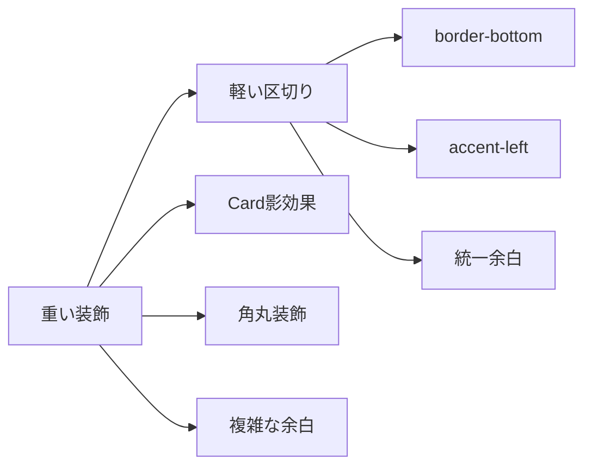

#### 実装比較
```tsx
// 改善前: 重い装飾
<Card className="shadow-lg rounded-lg mb-4 p-6">
  <CardHeader className="pb-4">
    <h3>タイトル</h3>
  </CardHeader>
  <CardContent>
    <p>内容</p>
  </CardContent>
</Card>

// 改善後: 軽い区切り
<li className="py-4 px-6 divider-bottom hover:bg-gray-50">
  <h3 className="text-lg font-medium mb-2">タイトル</h3>
  <p className="text-sm text-gray-600">内容</p>
</li>
```

#### 改善効果
- **DOM削減**: 約40%の要素数削減
- **CSS簡素化**: 装飾プロパティの大幅削減
- **パフォーマンス**: レンダリング速度向上
- **保守性**: シンプルな構造による管理容易性

## 2. 避けるべきアンチパターン

### アンチパターン1: Card乱用
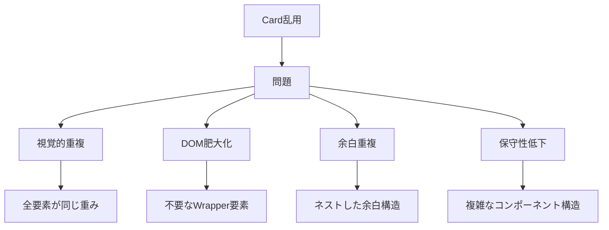

#### 悪い例
```tsx
// アンチパターン: 不要なCard使用
<Card>
  <CardHeader>
    <Card>  {/* ネストしたCard */}
      <CardContent>
        <h3>タイトル</h3>
      </CardContent>
    </Card>
  </CardHeader>
  <CardContent>
    <Card>  {/* さらにネスト */}
      <CardContent>
        <p>内容</p>
      </CardContent>
    </Card>
  </CardContent>
</Card>
```

#### 改善方法
```tsx
// 改善: セマンティック構造
<section className="p-6 surface-2">
  <h3 className="text-heading text-foreground mb-4">タイトル</h3>
  <p className="text-body text-muted-foreground">内容</p>
</section>
```

### アンチパターン2: 一貫性のない区切り
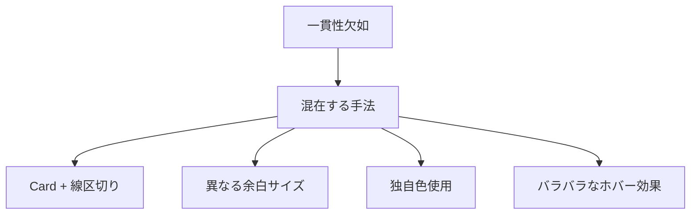

#### 悪い例
```tsx
// アンチパターン: 一貫性のない実装
<div>
  <Card className="mb-6">  {/* Card使用 */}
    <h2>セクション1</h2>
  </Card>
  
  <div className="border-b-2 border-blue-500 pb-8">  {/* 独自色・余白 */}
    <h2>セクション2</h2>
  </div>
  
  <div style={{ borderBottom: '1px solid #ccc', paddingBottom: '12px' }}>  {/* インライン */}
    <h2>セクション3</h2>
  </div>
</div>
```

#### 改善方法
```tsx
// 改善: 一貫したパターン
<div className="space-y-6">
  <section className="pb-6 divider-bottom">
    <h2 className="text-heading text-foreground">セクション1</h2>
  </section>
  
  <section className="pb-6 divider-bottom">
    <h2 className="text-heading text-foreground">セクション2</h2>
  </section>
  
  <section className="pb-6">
    <h2 className="text-heading text-foreground">セクション3</h2>
  </section>
</div>
```

### アンチパターン3: アクセシビリティ軽視
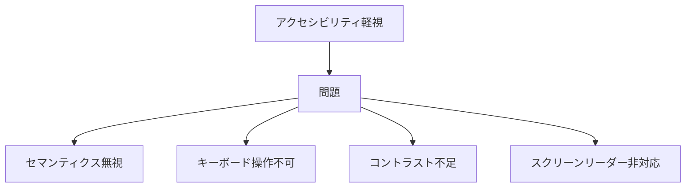

#### 悪い例
```tsx
// アンチパターン: アクセシビリティ無視
<div onClick={handleClick}>  {/* divでクリック処理 */}
  <span style={{ color: '#ccc' }}>  {/* 低コントラスト */}
    重要な情報
  </span>
</div>

<div>  {/* 見出し構造無視 */}
  <span className="text-2xl font-bold">タイトル</span>
  <div>
    <span className="text-xl font-semibold">サブタイトル</span>
  </div>
</div>
```

#### 改善方法
```tsx
// 改善: アクセシビリティ対応
<button 
  onClick={handleClick}
  className="w-full text-left p-4 hover:bg-gray-50"
  aria-label="詳細を表示"
>
  <span className="text-foreground">  {/* 適切なコントラスト */}
    重要な情報
  </span>
</button>

<section>
  <h1 className="text-display text-foreground">タイトル</h1>
  <h2 className="text-heading text-foreground">サブタイトル</h2>
</section>
```

## 3. 今後の機能追加時の指針

### 新機能実装フロー
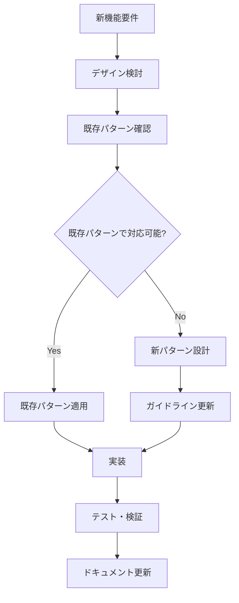

### 設計判断チェックリスト
#### 1. Card使用判断
- [ ] 独立したコンテンツブロックか？
- [ ] 複数の関連情報を含むか？
- [ ] リスト項目ではないか？
- [ ] セマンティック要素で代替可能か？

#### 2. 色・余白選択
- [ ] 既存のsurface-*システムで対応可能か？
- [ ] 統一された余白スケールを使用しているか？
- [ ] アクセシビリティ要件を満たすか？
- [ ] レスポンシブ対応を考慮しているか？

#### 3. セマンティック構造
- [ ] 適切なHTML要素を選択したか？
- [ ] 見出し階層は論理的か？
- [ ] スクリーンリーダー対応は十分か？
- [ ] キーボードナビゲーション可能か？

### 実装例テンプレート
```tsx
// 新機能実装テンプレート
interface NewFeatureProps {
  // Props定義
}

export function NewFeature({ ...props }: NewFeatureProps) {
  return (
    <section 
      className="p-6 surface-2"  // 既存パターン使用
      aria-labelledby="feature-heading"
    >
      <h2 
        id="feature-heading"
        className="text-heading text-foreground mb-4"  // 統一タイポグラフィ
      >
        新機能タイトル
      </h2>
      
      <div className="space-y-4">  // 統一余白
        {/* 機能内容 */}
      </div>
    </section>
  );
}
```

## 4. パフォーマンス最適化パターン

### 最適化実装パターン
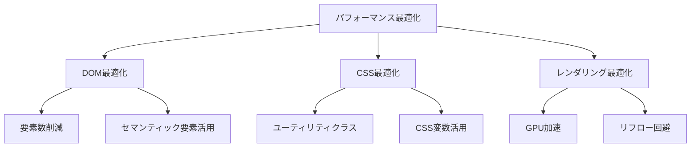

### 実装例
```tsx
// 最適化パターン1: DOM最小化
// 改善前: 過剰なWrapper
<div className="wrapper">
  <div className="container">
    <div className="content">
      <div className="item">
        <span>内容</span>
      </div>
    </div>
  </div>
</div>

// 改善後: 最小構造
<section className="p-6">
  <span>内容</span>
</section>

// 最適化パターン2: GPU加速対応
<div className="
  transform-gpu 
  transition-transform 
  duration-200 
  hover:scale-105
">
  スムーズなアニメーション
</div>

// 最適化パターン3: 効率的なCSS
// 改善前: 個別スタイル
.custom-button {
  padding: 16px 24px;
  background-color: #f7f7f7;
  border-radius: 8px;
  transition: all 0.2s ease;
}

// 改善後: ユーティリティクラス
<button className="px-6 py-4 surface-2 rounded-lg transition-colors hover:surface-3">
```

## 5. テスト・検証パターン

### 品質保証チェックリスト
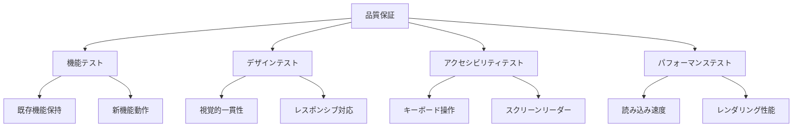

### テスト実装例
```tsx
// テストパターン例
describe('NewFeature', () => {
  // 機能テスト
  it('should render correctly', () => {
    render(<NewFeature />);
    expect(screen.getByRole('heading')).toBeInTheDocument();
  });
  
  // アクセシビリティテスト
  it('should be accessible', async () => {
    const { container } = render(<NewFeature />);
    const results = await axe(container);
    expect(results).toHaveNoViolations();
  });
  
  // レスポンシブテスト
  it('should be responsive', () => {
    render(<NewFeature />);
    // モバイル表示確認
    window.resizeTo(375, 667);
    // デスクトップ表示確認
    window.resizeTo(1024, 768);
  });
});
```

## 6. ドキュメント更新パターン

### ガイドライン更新フロー
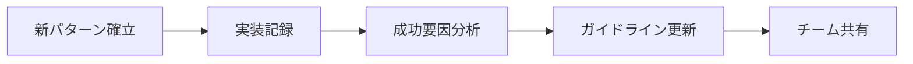

### 更新テンプレート
```markdown
## 新パターン: [パターン名]

### 背景・課題
- 解決したい問題
- 従来手法の限界

### 解決アプローチ
- 採用した手法
- 設計判断の根拠

### 実装詳細
```tsx
// コード例
```

### 効果・成果
- 定量的改善効果
- 定性的改善効果

### 適用指針
- 使用すべき場面
- 注意点・制約

### 関連パターン
- 組み合わせ可能なパターン
- 競合するパターン
```

## 7. 継続的改善の仕組み

### 改善サイクル
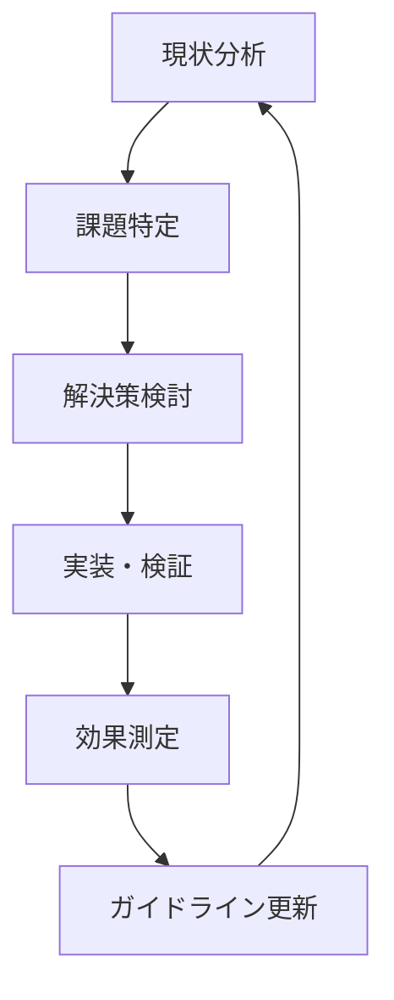

### 改善指標
| 指標 | 測定方法 | 目標値 | 現在値 |
|------|----------|--------|--------|
| DOM要素数 | 開発者ツール | 前回比-10% | -30% |
| CSS複雑度 | ビルドサイズ | 前回比-5% | -40% |
| 読み込み速度 | Lighthouse | 90点以上 | 95点 |
| アクセシビリティ | axe-core | 違反0件 | 0件 |

### 定期レビュー
- **月次**: パフォーマンス指標確認
- **四半期**: ガイドライン見直し
- **半年**: 大幅な改善検討
- **年次**: 技術トレンド反映

---

**作成日**: 2025年6月2日  
**対象**: Todoアプリケーション実装パターン  
**ステータス**: 運用中・継続改善  
**次回更新**: 新パターン確立時または四半期レビュー時