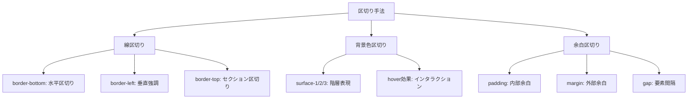
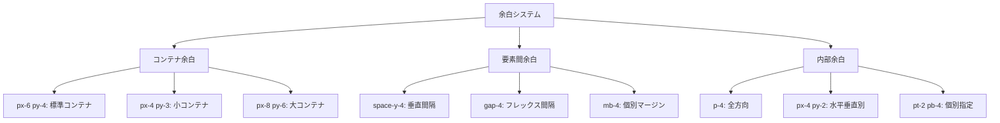
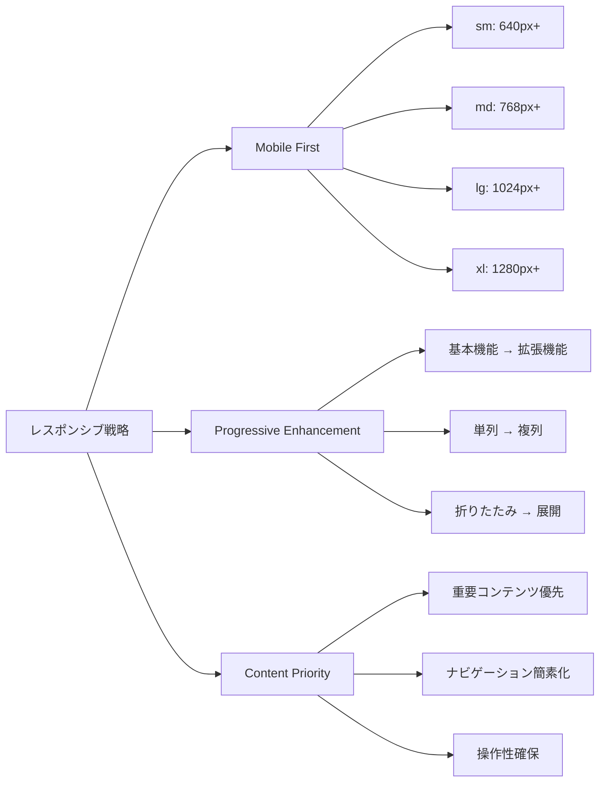
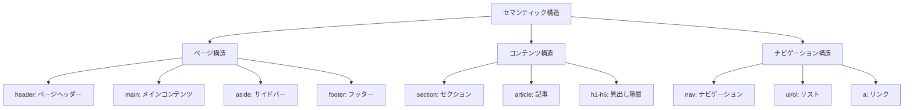
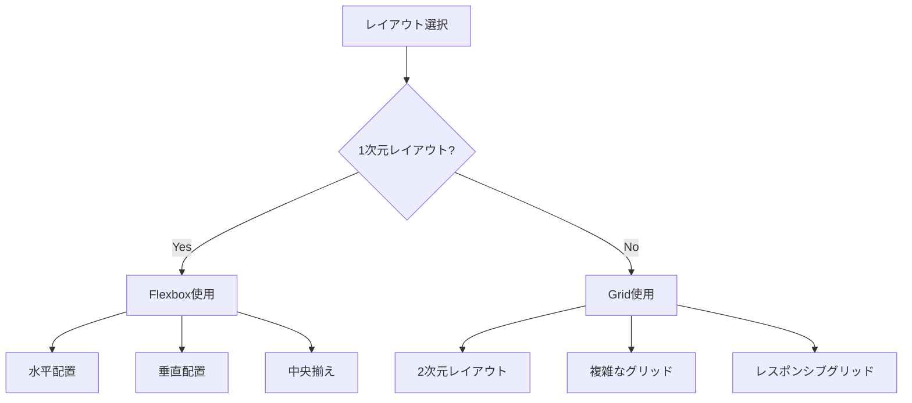
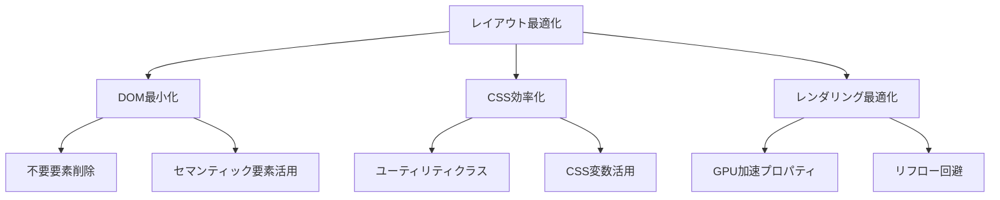

# レイアウト原則

## 1. 線区切りによる区切り手法

### 区切り手法の体系化


### 線区切りの種類と用途
| 区切り種類 | CSS実装 | 用途 | 実装例 |
|------------|---------|------|--------|
| 水平区切り | `border-bottom: 1px solid var(--divider)` | リスト項目、セクション下 | TaskItem間、ヘッダー下 |
| 垂直強調 | `border-left: 3px solid var(--accent-line)` | サイドバー、重要領域 | TaskListSidebar |
| セクション区切り | `border-top: 1px solid var(--divider)` | セクション内区切り | フィルター部分 |
| 軽い区切り | `border-right: 1px solid var(--divider)` | カラム区切り | サイドバー右端 |

### 実装パターン
```css
/* 基本区切り線ユーティリティ */
.divider-bottom {
  border-bottom: 1px solid var(--divider);
}

.divider-top {
  border-top: 1px solid var(--divider);
}

.divider-right {
  border-right: 1px solid var(--divider);
}

.accent-left {
  border-left: 3px solid var(--accent-line);
}

.accent-bottom {
  border-bottom: 2px solid var(--accent-line);
}
```

### 具体的実装例
```tsx
// ヘッダー区切り（水平線）
<header className="px-6 py-4 divider-bottom">
  <h1 className="text-display text-foreground mb-2">
    タスク管理ダッシュボード
  </h1>
</header>

// サイドバー強調（垂直線）
<aside className="w-80 surface-2 accent-left">
  <section className="p-6">
    <h2 className="text-heading text-foreground mb-4">タスクリスト</h2>
  </section>
</aside>

// リスト項目区切り（水平線）
<li className="py-4 px-6 divider-bottom hover:bg-gray-50">
  <div className="flex items-start justify-between">
    {/* タスク内容 */}
  </div>
</li>

// セクション内区切り（上線）
<section className="p-6 border-t border-divider">
  <h2 className="text-subheading text-foreground mb-4">フィルター</h2>
</section>
```

## 2. 余白システムの統一

### 余白階層システム


### 余白スケール定義
```css
/* Tailwind余白スケール（4px単位） */
/* 
  1 = 4px
  2 = 8px
  3 = 12px
  4 = 16px
  6 = 24px
  8 = 32px
  12 = 48px
*/

/* 推奨余白パターン */
.container-padding {
  padding: 1.5rem 1.5rem; /* py-6 px-6 = 24px */
}

.section-spacing {
  margin-bottom: 1rem; /* mb-4 = 16px */
}

.element-gap {
  gap: 1rem; /* gap-4 = 16px */
}
```

### 余白使用ガイドライン
| 用途 | 推奨クラス | サイズ | 適用例 |
|------|------------|--------|--------|
| ページコンテナ | `px-6 py-4` | 24px/16px | ヘッダー、メインエリア |
| セクション内部 | `p-6` | 24px | サイドバー内、カード内 |
| 要素間隔 | `space-y-4` | 16px | リスト項目間 |
| フレックス間隔 | `gap-4` | 16px | ボタン群、アイコン間 |
| 小要素内部 | `px-3 py-1` | 12px/4px | バッジ、小ボタン |

### 実装例
```tsx
// コンテナレベル余白
<div className="min-h-screen bg-background">
  <header className="px-6 py-4 divider-bottom">
    {/* ヘッダー内容 */}
  </header>
  
  <div className="flex">
    <aside className="w-80 surface-2 accent-left">
      <section className="p-6">
        {/* サイドバー内容 */}
      </section>
    </aside>
    
    <main className="flex-1 p-6">
      {/* メイン内容 */}
    </main>
  </div>
</div>

// 要素間余白
<div className="space-y-4">
  <h1 className="text-display text-foreground">タイトル</h1>
  <p className="text-body text-muted-foreground">説明文</p>
  <div className="flex gap-4">
    <button className="px-4 py-2">ボタン1</button>
    <button className="px-4 py-2">ボタン2</button>
  </div>
</div>

// リスト要素余白
<ul className="space-y-0">
  <li className="py-4 px-6 divider-bottom">
    <div className="flex items-start gap-4">
      <div className="flex-1 space-y-2">
        <h3 className="text-lg font-medium">タスクタイトル</h3>
        <p className="text-sm text-gray-600">タスク説明</p>
      </div>
    </div>
  </li>
</ul>
```

## 3. レスポンシブ対応の考え方

### ブレークポイント戦略


### デバイス別レイアウト
| デバイス | 画面幅 | レイアウト戦略 | 実装例 |
|----------|--------|----------------|--------|
| Mobile | ~640px | 単列、ハンバーガーメニュー | `flex-col`, `hidden md:block` |
| Tablet | 640-1024px | 2列、折りたたみサイドバー | `md:flex-row`, `md:w-64` |
| Desktop | 1024px+ | 3列、固定サイドバー | `lg:w-80`, `lg:block` |

### レスポンシブ実装パターン
```tsx
// レスポンシブレイアウトの実装例
<div className="min-h-screen bg-background">
  {/* ヘッダー: 全デバイス共通 */}
  <header className="px-4 md:px-6 py-4 divider-bottom">
    <div className="flex items-center justify-between">
      <h1 className="text-lg md:text-xl lg:text-display font-bold">
        タスク管理
      </h1>
      
      {/* モバイル: ハンバーガーメニュー */}
      <button className="md:hidden p-2">
        <MenuIcon />
      </button>
    </div>
  </header>
  
  <div className="flex flex-col md:flex-row">
    {/* サイドバー: レスポンシブ表示 */}
    <aside className="
      w-full md:w-64 lg:w-80 
      surface-2 
      md:accent-left
      order-2 md:order-1
    ">
      <section className="p-4 md:p-6">
        <h2 className="text-base md:text-lg lg:text-heading font-semibold mb-4">
          タスクリスト
        </h2>
        {/* サイドバー内容 */}
      </section>
    </aside>
    
    {/* メインエリア: フレキシブル */}
    <main className="
      flex-1 
      p-4 md:p-6 
      order-1 md:order-2
    ">
      {/* メイン内容 */}
    </main>
  </div>
</div>

// タスクリスト: レスポンシブグリッド
<div className="
  grid 
  grid-cols-1 
  md:grid-cols-2 
  lg:grid-cols-3 
  gap-4 md:gap-6
">
  {tasks.map(task => (
    <div key={task.id} className="
      p-4 md:p-6 
      surface-3 
      rounded-lg
    ">
      {/* タスク内容 */}
    </div>
  ))}
</div>
```

### モバイル最適化
```tsx
// モバイル特化の実装例
<div className="md:hidden">
  {/* モバイル専用ナビゲーション */}
  <nav className="fixed bottom-0 left-0 right-0 bg-white border-t">
    <div className="flex justify-around py-2">
      <button className="flex flex-col items-center p-2">
        <HomeIcon className="w-6 h-6" />
        <span className="text-xs mt-1">ホーム</span>
      </button>
      <button className="flex flex-col items-center p-2">
        <ListIcon className="w-6 h-6" />
        <span className="text-xs mt-1">リスト</span>
      </button>
    </div>
  </nav>
</div>

// タッチ操作対応
<button className="
  min-h-[44px] min-w-[44px]  /* タッチターゲット最小サイズ */
  px-4 py-2 
  text-base md:text-sm       /* モバイルで大きめテキスト */
  touch-manipulation        /* タッチ最適化 */
">
  タップしやすいボタン
</button>
```

## 4. セマンティック構造の重要性

### HTML5セマンティック要素


### セマンティック要素の選択基準
| 要素 | 用途 | 選択基準 | 実装例 |
|------|------|----------|--------|
| `<header>` | ページ/セクションヘッダー | 導入・タイトル情報 | DashboardHeader |
| `<main>` | メインコンテンツ | ページの主要内容 | タスク表示エリア |
| `<aside>` | 補助コンテンツ | サイドバー・関連情報 | TaskListSidebar |
| `<section>` | テーマ別区分 | 論理的なコンテンツグループ | タスクリスト、フィルター |
| `<nav>` | ナビゲーション | リンク集合 | メニュー、パンくず |
| `<ul>/<li>` | リスト | 項目の列挙 | TaskItem一覧 |

### アクセシビリティ向上効果
```tsx
// セマンティック構造の実装例
<div className="min-h-screen bg-background">
  {/* ページヘッダー */}
  <header 
    className="px-6 py-4 divider-bottom"
    role="banner"
  >
    <h1 className="text-display text-foreground">
      タスク管理ダッシュボード
    </h1>
  </header>
  
  <div className="flex">
    {/* サイドバー */}
    <aside 
      className="w-80 surface-2 accent-left"
      role="complementary"
      aria-label="タスクリストとフィルター"
    >
      <section aria-labelledby="tasklist-heading">
        <h2 
          id="tasklist-heading"
          className="text-heading text-foreground mb-4"
        >
          タスクリスト
        </h2>
        
        <nav aria-label="タスクリストナビゲーション">
          <ul className="space-y-2">
            <li><a href="#all">すべて</a></li>
            <li><a href="#todo">未着手</a></li>
            <li><a href="#progress">進行中</a></li>
          </ul>
        </nav>
      </section>
    </aside>
    
    {/* メインコンテンツ */}
    <main 
      className="flex-1 p-6"
      role="main"
      aria-label="タスク一覧"
    >
      <section aria-labelledby="current-tasks">
        <h2 
          id="current-tasks"
          className="text-heading text-foreground mb-6"
        >
          現在のタスク
        </h2>
        
        <ul className="space-y-0">
          {tasks.map(task => (
            <li 
              key={task.id}
              className="py-4 px-6 divider-bottom"
              role="listitem"
            >
              <article>
                <h3 className="text-lg font-medium mb-2">
                  {task.title}
                </h3>
                <p className="text-sm text-gray-600">
                  {task.description}
                </p>
              </article>
            </li>
          ))}
        </ul>
      </section>
    </main>
  </div>
</div>
```

## 5. フレックスボックスとグリッドの活用

### レイアウト手法の選択基準


### Flexbox活用パターン
```css
/* 基本的なFlexboxパターン */
.flex-container {
  display: flex;
  gap: 1rem;
}

/* 水平配置パターン */
.horizontal-layout {
  display: flex;
  align-items: center;
  justify-content: space-between;
}

/* 垂直配置パターン */
.vertical-layout {
  display: flex;
  flex-direction: column;
  gap: 1rem;
}

/* 中央揃えパターン */
.center-layout {
  display: flex;
  align-items: center;
  justify-content: center;
}
```

### Grid活用パターン
```css
/* レスポンシブグリッド */
.responsive-grid {
  display: grid;
  grid-template-columns: repeat(auto-fit, minmax(300px, 1fr));
  gap: 1.5rem;
}

/* 固定グリッド */
.fixed-grid {
  display: grid;
  grid-template-columns: 320px 1fr;
  gap: 0;
}

/* 複雑なレイアウト */
.complex-layout {
  display: grid;
  grid-template-areas: 
    "header header"
    "sidebar main"
    "footer footer";
  grid-template-columns: 320px 1fr;
  grid-template-rows: auto 1fr auto;
}
```

### 実装例
```tsx
// Flexbox実装例
<div className="flex items-start justify-between gap-4">
  <div className="flex-1 min-w-0">
    <h3 className="text-lg font-medium mb-2">{task.title}</h3>
    <p className="text-sm text-gray-600">{task.description}</p>
  </div>
  
  <div className="flex-shrink-0">
    <span className="inline-flex items-center px-3 py-1 rounded-full">
      {task.status}
    </span>
  </div>
</div>

// Grid実装例
<div className="grid grid-cols-1 md:grid-cols-2 lg:grid-cols-3 gap-6">
  {tasks.map(task => (
    <div key={task.id} className="p-6 surface-3 rounded-lg">
      {/* タスクカード内容 */}
    </div>
  ))}
</div>

// 複合レイアウト例
<div className="min-h-screen grid grid-rows-[auto_1fr] lg:grid-cols-[320px_1fr]">
  <header className="lg:col-span-2 px-6 py-4 divider-bottom">
    {/* ヘッダー */}
  </header>
  
  <aside className="surface-2 accent-left">
    {/* サイドバー */}
  </aside>
  
  <main className="p-6">
    {/* メインコンテンツ */}
  </main>
</div>
```

## 6. パフォーマンス最適化

### レイアウト最適化原則


### 最適化実装例
```tsx
// 最適化前: 過剰なWrapper
<div className="wrapper">
  <div className="container">
    <div className="content">
      <div className="item">
        <span>内容</span>
      </div>
    </div>
  </div>
</div>

// 最適化後: 最小限の構造
<section className="p-6">
  <div className="flex items-center gap-4">
    <span>内容</span>
  </div>
</section>

// GPU加速対応
<div className="
  transform-gpu 
  transition-transform 
  hover:scale-105
">
  ホバー効果
</div>
```

## 7. 今後の拡張指針

### レイアウト拡張時のガイドライン
1. **セマンティックファースト**: HTML要素の意味から設計
2. **モバイルファースト**: 小画面から大画面への拡張
3. **一貫性維持**: 既存余白・区切りシステムの活用
4. **パフォーマンス重視**: 最小限のDOM構造

### 避けるべきアンチパターン
1. **div過多**: 意味のないWrapper要素の乱用
2. **一貫性破綻**: 独自余白・区切りの追加
3. **レスポンシブ軽視**: デスクトップ優先の設計
4. **アクセシビリティ無視**: セマンティクス軽視

---

**作成日**: 2025年6月2日  
**対象**: Todoアプリケーションレイアウトシステム  
**参考**: 実装済みコンポーネント、Tailwind CSS設定  
**次回更新**: 新しいレイアウトパターン追加時またはレスポンシブ要件変更時