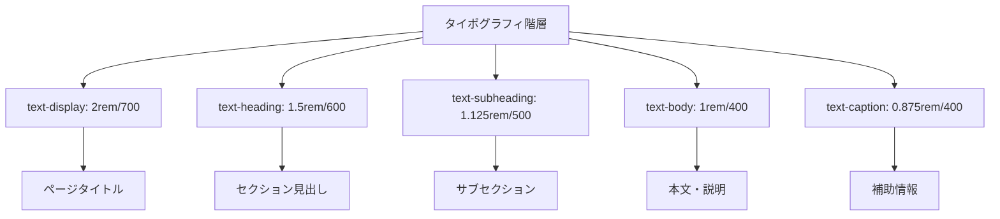
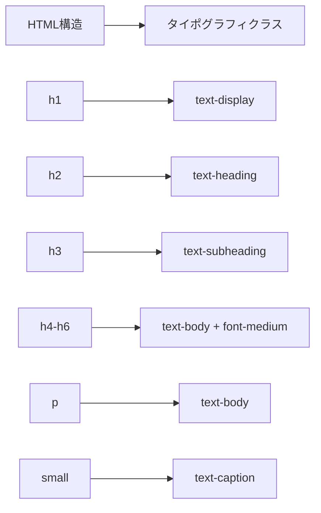
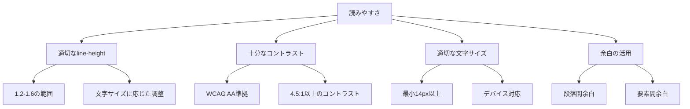
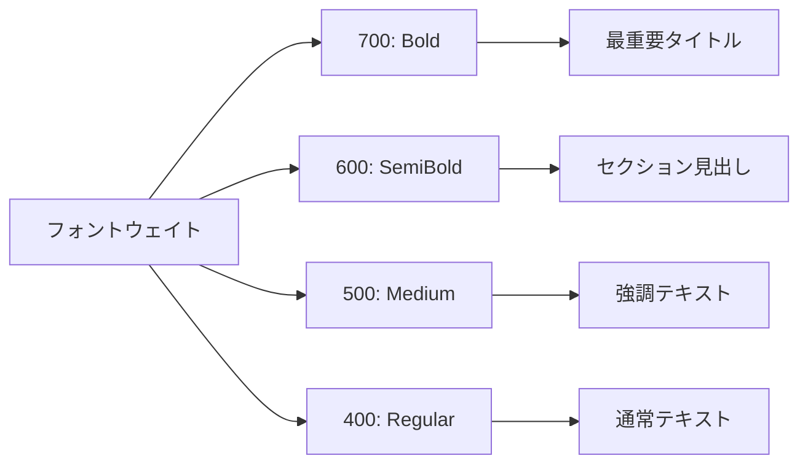
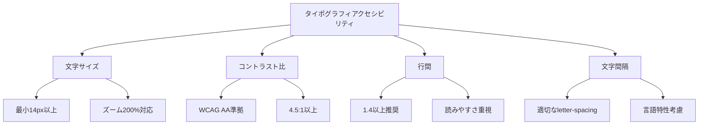

# タイポグラフィガイド

## 1. タイポグラフィスケールの定義

### 階層的テキストシステム


### 具体的な定義
```css
/* タイポグラフィスケール定義 */
@layer utilities {
  .text-display {
    font-size: 2rem;        /* 32px */
    font-weight: 700;       /* Bold */
    line-height: 1.2;       /* 38.4px */
  }
  
  .text-heading {
    font-size: 1.5rem;      /* 24px */
    font-weight: 600;       /* SemiBold */
    line-height: 1.3;       /* 31.2px */
  }
  
  .text-subheading {
    font-size: 1.125rem;    /* 18px */
    font-weight: 500;       /* Medium */
    line-height: 1.4;       /* 25.2px */
  }
  
  .text-body {
    font-size: 1rem;        /* 16px */
    font-weight: 400;       /* Regular */
    line-height: 1.5;       /* 24px */
  }
  
  .text-caption {
    font-size: 0.875rem;    /* 14px */
    font-weight: 400;       /* Regular */
    line-height: 1.4;       /* 19.6px */
  }
}
```

### スケール比率と設計原理
- **基準サイズ**: 1rem (16px) を基準とした相対サイズ
- **スケール比率**: 約1.125倍（Major Second）の調和的比率
- **line-height**: 読みやすさを重視した適切な行間設定
- **font-weight**: 階層を明確にする重み設定

## 2. 見出し階層の使い分け

### HTML見出し要素との対応


### 使用ガイドライン
| HTML要素 | タイポグラフィクラス | 用途 | 実装例 |
|----------|---------------------|------|--------|
| `<h1>` | `text-display` | ページタイトル | ダッシュボードタイトル |
| `<h2>` | `text-heading` | セクション見出し | タスクリスト、フィルター |
| `<h3>` | `text-subheading` | サブセクション | タスクカテゴリ |
| `<h4>-<h6>` | `text-body font-medium` | 小見出し | タスク項目タイトル |
| `<p>` | `text-body` | 本文 | タスク説明、案内文 |
| `<small>` | `text-caption` | 補助情報 | 日付、ステータス |

### 実装例
```tsx
// ページタイトル（h1 + text-display）
<h1 className="text-display text-foreground mb-2">
  タスク管理ダッシュボード
</h1>

// セクション見出し（h2 + text-heading）
<h2 className="text-heading text-foreground mb-4">
  タスクリスト
</h2>

// サブセクション（h3 + text-subheading）
<h3 className="text-subheading text-foreground mb-3">
  進行中のタスク
</h3>

// タスクタイトル（h4 + text-body + font-medium）
<h4 className="text-body font-medium text-gray-900 mb-2">
  {task.title}
</h4>

// 本文（p + text-body）
<p className="text-body text-muted-foreground">
  タスクを効率的に管理し、プロジェクトを成功に導きましょう。
</p>

// 補助情報（small + text-caption）
<small className="text-caption text-gray-500">
  期限: {new Date(task.dueDate).toLocaleDateString('ja-JP')}
</small>
```

## 3. 読みやすさの確保方法

### 読みやすさの要素


### line-height設計原理
```css
/* line-height設計ルール */
.text-display {
  line-height: 1.2;  /* 大きな文字: タイトな行間 */
}

.text-heading {
  line-height: 1.3;  /* 見出し: やや詰めた行間 */
}

.text-subheading {
  line-height: 1.4;  /* サブ見出し: バランス重視 */
}

.text-body {
  line-height: 1.5;  /* 本文: 読みやすさ重視 */
}

.text-caption {
  line-height: 1.4;  /* 小文字: 適度な行間 */
}
```

### コントラスト比の確保
```css
/* 推奨文字色パターン */
.text-primary {
  color: var(--foreground);        /* 14.8:1 - 最高コントラスト */
}

.text-secondary {
  color: var(--muted-foreground);  /* 7.2:1 - 十分なコントラスト */
}

.text-tertiary {
  color: oklch(0.7 0 0);          /* 4.6:1 - 最小限コントラスト */
}
```

### 余白システムとの連携
```tsx
// 適切な余白を含む実装例
<div className="space-y-4">
  <h1 className="text-display text-foreground mb-2">
    メインタイトル
  </h1>
  
  <p className="text-body text-muted-foreground mb-6">
    説明文は十分な余白を確保して読みやすさを向上させます。
  </p>
  
  <section className="space-y-3">
    <h2 className="text-heading text-foreground mb-4">
      セクション見出し
    </h2>
    
    <p className="text-body text-foreground leading-relaxed">
      本文は適切な行間（leading-relaxed = line-height: 1.625）で
      読みやすさを確保します。
    </p>
  </section>
</div>
```

## 4. フォントウェイト活用パターン

### ウェイト階層システム


### 使用パターン
| ウェイト | 用途 | 実装例 | 注意点 |
|----------|------|--------|--------|
| `font-bold (700)` | ページタイトル | `text-display` | 最重要要素のみ |
| `font-semibold (600)` | セクション見出し | `text-heading` | 階層の明確化 |
| `font-medium (500)` | 強調テキスト | タスクタイトル | 適度な強調 |
| `font-normal (400)` | 通常テキスト | 本文・説明 | 基本ウェイト |

### 実装例
```tsx
// ウェイト活用の実装例
<div className="space-y-4">
  {/* 最重要: Bold (700) */}
  <h1 className="text-2xl font-bold text-gray-900">
    タスク管理ダッシュボード
  </h1>
  
  {/* 重要: SemiBold (600) */}
  <h2 className="text-xl font-semibold text-gray-800">
    今日のタスク
  </h2>
  
  {/* 強調: Medium (500) */}
  <h3 className="text-lg font-medium text-gray-900">
    {task.title}
  </h3>
  
  {/* 通常: Regular (400) */}
  <p className="text-base font-normal text-gray-600">
    {task.description}
  </p>
  
  {/* 補助: Regular (400) + 小サイズ */}
  <span className="text-sm font-normal text-gray-500">
    期限: {task.dueDate}
  </span>
</div>
```

## 5. レスポンシブタイポグラフィ

### デバイス別調整
```css
/* レスポンシブタイポグラフィ */
@media (max-width: 768px) {
  .text-display {
    font-size: 1.75rem;  /* 28px - モバイルで縮小 */
    line-height: 1.25;
  }
  
  .text-heading {
    font-size: 1.25rem;  /* 20px - モバイルで縮小 */
    line-height: 1.35;
  }
}

@media (max-width: 480px) {
  .text-display {
    font-size: 1.5rem;   /* 24px - 小画面でさらに縮小 */
    line-height: 1.3;
  }
}
```

### Tailwindレスポンシブクラス活用
```tsx
// レスポンシブタイポグラフィの実装
<h1 className="text-xl md:text-2xl lg:text-display font-bold">
  タスク管理ダッシュボード
</h1>

<h2 className="text-lg md:text-xl lg:text-heading font-semibold">
  タスクリスト
</h2>

<p className="text-sm md:text-base lg:text-body">
  説明文はデバイスサイズに応じて調整されます。
</p>
```

## 6. アクセシビリティ考慮事項

### 視覚的アクセシビリティ


### 実装チェックリスト
- [ ] 最小文字サイズ14px以上
- [ ] コントラスト比4.5:1以上
- [ ] line-height 1.4以上
- [ ] ズーム200%での可読性
- [ ] スクリーンリーダー対応

### アクセシブルな実装例
```tsx
// アクセシビリティを考慮した実装
<div className="space-y-4">
  <h1 
    className="text-display text-foreground"
    role="heading" 
    aria-level="1"
  >
    タスク管理ダッシュボード
  </h1>
  
  <p 
    className="text-body text-foreground leading-relaxed"
    aria-describedby="dashboard-description"
  >
    タスクを効率的に管理し、プロジェクトを成功に導きましょう。
  </p>
  
  <div 
    className="text-caption text-muted-foreground"
    aria-label="補助情報"
  >
    最終更新: {lastUpdated}
  </div>
</div>
```

## 7. 実装ベストプラクティス

### タイポグラフィクラス使用原則
1. **一貫性**: 定義済みクラスを優先使用
2. **階層性**: HTML構造とタイポグラフィの対応
3. **可読性**: 適切なコントラストと行間
4. **レスポンシブ**: デバイス対応の考慮

### 推奨実装パターン
```tsx
// 推奨: 定義済みクラス使用
<h1 className="text-display text-foreground">

// 推奨: 適切な色指定
<p className="text-body text-muted-foreground">

// 避ける: 直接スタイル指定
<h1 style={{ fontSize: '32px', fontWeight: 700 }}>

// 避ける: 一貫性のないサイズ
<h1 className="text-3xl font-black">
```

### パフォーマンス考慮事項
```css
/* 効率的: ユーティリティクラス */
.text-display { /* 事前定義済み */ }

/* 非効率: 個別スタイル */
.custom-title {
  font-size: 2rem;
  font-weight: 700;
  line-height: 1.2;
}
```

## 8. 今後の拡張指針

### 新しいタイポグラフィ追加時のガイドライン
1. **既存スケール確認**: 現在の5段階で対応可能か検討
2. **用途明確化**: 新しいサイズの使用目的を明文化
3. **一貫性維持**: 既存比率との調和確保
4. **アクセシビリティ**: 最小サイズ・コントラスト確認

### 避けるべきアンチパターン
1. **サイズ乱用**: 不要なサイズバリエーション追加
2. **一貫性破綻**: 既存スケールを無視したサイズ使用
3. **可読性軽視**: 小さすぎる文字・低いコントラスト
4. **保守性無視**: 直接スタイル指定の多用

---

**作成日**: 2025年6月2日  
**対象**: Todoアプリケーションタイポグラフィシステム  
**参考**: globals.css, Tailwind Typography設定  
**次回更新**: 新しいタイポグラフィ要件発生時または日本語フォント最適化時